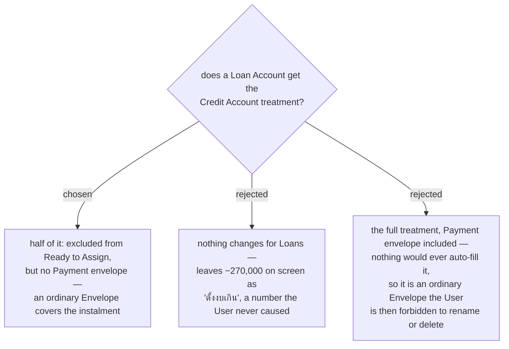

# Loan accounts leave Ready to Assign, but get no payment envelope

`GetMonthlySummaryHandler` sums **every** **Account** with no filter on type, so a **Loan**
**Account** is inside **Ready to Assign** exactly as a **Credit** one was. With 30,000 in the bank
and 300,000 outstanding on a car loan, the budget screen reads **พร้อมจัดสรร −270,000 ·
ตั้งงบเกิน -270,000**. That is menunest-203's wrong story in a second place, and it is in the app
today, independent of issue #112. The exclusion is the same one-line filter, so the fix costs
nothing extra and option B leaves a known-false number on screen for no saving.

But a **Loan** is not a card. Nothing is ever *bought* with it: it arrives once and is paid down.
The mechanism menunest-202 exists for — a **Budget transaction** on the account moving money out of
the **Envelope** it was spent from — has no work to do on a loan, so a **Payment envelope** there
would only ever be filled by hand. That is precisely an ordinary **Envelope**, except that
menunest-205 would forbid renaming, regrouping or deleting it. The costume makes it strictly worse
than the plain thing.

So: a **Loan** leaves **Ready to Assign**, and the **User** budgets the instalment in an ordinary
**Envelope** they make and name themselves ("ผ่อนรถ").

**A Payment envelope earns its existence only where spending happens on the Account.**
