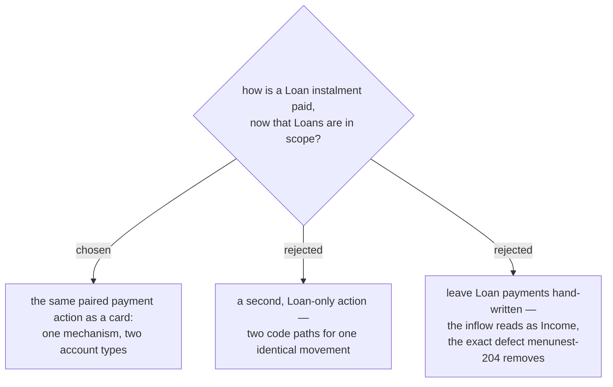

# One payment action serves both Credit and Loan accounts

Refines menunest-204, which named the action **จ่ายบัตร** while only **Credit** **Accounts** were
in scope. menunest-206 brings **Loan** **Accounts** in, and paying a loan instalment is the same
movement as paying a card: cash out of one **Account**, in against a debt on another, two
**Budget transactions** that must be written as one pair.

Every reason menunest-204 gave applies unchanged to a loan — a bare inflow on the **Loan**
**Account** carries no **Envelope**, so `GetMonthlySummaryHandler` counts it as **Income**, and
nothing binds the halves. Two actions for one movement would duplicate that logic and let the
copies drift.

The one asymmetry stays: on a **Credit** **Account** the payment also spends down the
**Payment envelope**; on a **Loan** it does not, because menunest-206 gives a **Loan** none — the
money comes from whatever ordinary **Envelope** the **User** made for the instalment. Same action,
one branch at the end.

## Consequences

- The action's user-facing name can no longer be **จ่ายบัตร** alone, since it also pays loans.
  The glossary term and the button label need one word that covers both; naming is open.
