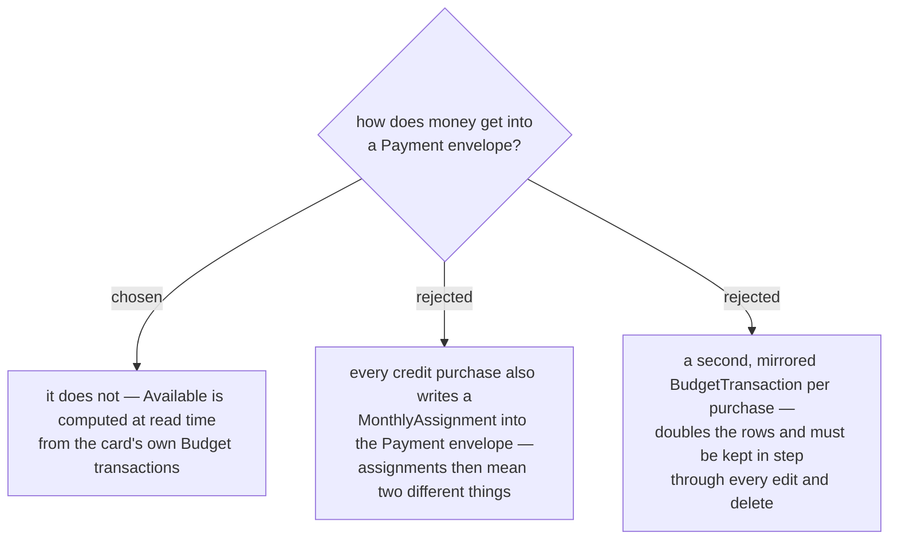

# The payment envelope's Available is derived, never stored

Decided rather than grilled: the **User** cannot observe the difference, and MenuNest has already
made this call twice — menunest-182 and menunest-183 derive an **Account**'s balance from its
**Budget transactions** rather than storing it, on the grounds that a stored figure and its history
drift apart.

A **Payment envelope**'s **Available** is:

> money the **User** assigned into it
> **＋** every categorised outflow on its Credit **Account** (the purchase was funded, so its money is owed here)
> **−** every payment made against that **Account**

No row is written when a card is tapped beyond the **Budget transaction** the **User** already
made. Editing that transaction's amount, moving it to another **Envelope**, or deleting it flows
through for free, because nothing was copied anywhere to fall out of step. Options B and C both
require a mirrored row and a reconciliation path for every edit and delete — the class of bug
menunest-182 removed from account balances.

## Consequences

- An **uncategorised** outflow on a Credit **Account** (a cash advance, an unassigned purchase)
  adds nothing to the **Payment envelope**. It is unfunded debt and reads as the gap, exactly like
  **Pre-budget debt** — which is the truth about it.
- `GetMonthlySummaryHandler`'s single `ComputeEnvelopeAvailable` walk no longer serves every
  **Envelope**; a **Payment envelope** needs its own derivation beside it.
