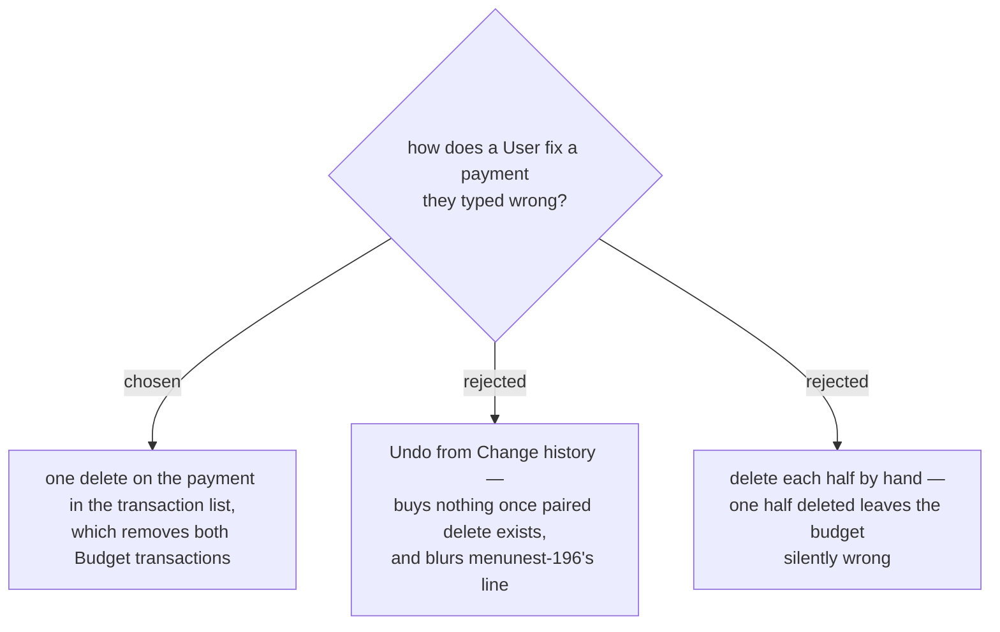

# A payment is deleted as a pair, not undone from Change history

menunest-196 drew **Change history** at money the **User** *placed* — assigning, moving, covering —
and deliberately left **Budget transactions** out. A payment (menunest-204, menunest-207) is two
**Budget transactions**, so by that line it is fixed where transactions are fixed.

The pair still has to be protected, and that protection is needed whatever this ADR decides:
nothing stops a **User** opening the account's transaction list and deleting only the cash side,
which leaves the debt paid in the budget and unpaid on the card. So **one press deletes both**, and
the list shows the payment as **one row**, not two. Once that exists, an **Undo** slot adds no
capability — only a second place to learn.

The **User** asked for one button that does both things. This is that button, on the way out as
well as the way in.

## Consequences

- Editing a payment's amount is the same rule: the edit applies to both halves or to neither.
- The **Shortcut rail** is unchanged. It keeps exactly its three menunest-191 slots.
