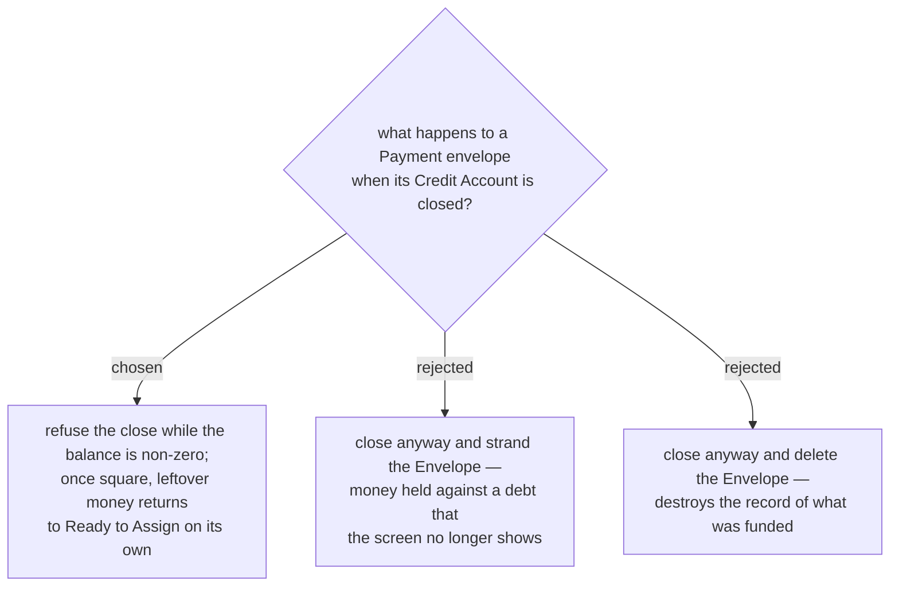

# A credit account cannot be closed while it still owes

Deleting is already safe: `DeleteAccountHandler` refuses any **Account** carrying **Budget
transactions** — *"Cannot delete account with transactions — close it instead."* A Credit
**Account** that has ever been used therefore cannot be deleted at all, and an unused one has an
empty **Payment envelope**, so both go together harmlessly.

Closing is the real case, and it takes the same posture the codebase already takes on delete:
refuse rather than lose data quietly. A card with money still owed on it is not closed in life
either, and menunest-205 forbids deleting the **Payment envelope** precisely because it can hold
money against a live debt — closing the **Account** would reach the same end by the side door.

Once the balance is zero, no special cleanup is needed. menunest-208 derives the **Payment
envelope**'s **Available**, and a closed **Account**'s **Envelope** leaves the envelope total, so
**Ready to Assign** rises by whatever was left in it — the over-funded remainder finds its way back
with no code that "moves" anything.
