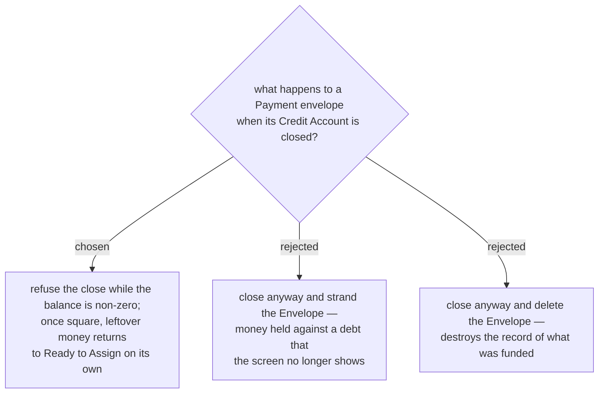

# A credit account cannot be closed while it still owes

Deleting is half-safe on its own: `DeleteAccountHandler` refuses any **Account** carrying **Budget
transactions** — *"Cannot delete account with transactions — close it instead."* A Credit
**Account** that has ever been used therefore cannot be deleted at all, which is why this ADR is
about closing rather than about deleting.

An **unused** card is the case that needed work, and an earlier version of this paragraph got it
wrong. It said the unused card "has an empty **Payment envelope**, so both go together harmlessly",
and that sentence is what justified writing no delete guard at all. They do not go together: the
**Payment envelope** carries the foreign key
(`BudgetCategoryConfiguration`: `HasForeignKey(x => x.PaymentForAccountId).OnDelete(DeleteBehavior.Restrict)`),
`DeleteAccountHandler` never loads it, and so EF issues a bare `DELETE` on the **Account** which
the database refuses — `FOREIGN KEY constraint failed`, an unhandled `DbUpdateException`, HTTP 500,
*"An unexpected error occurred."* on a card with zero transactions. Deleting an unused card worked
before menunest-202 gave every Credit **Account** an **Envelope**, so leaving it there was a
regression this feature introduced.

What the handler does now: before removing the **Account** it removes that **Account**'s **Payment
envelope**, together with the envelope's `MonthlyAssignment` rows (that FK is `Restrict` too, so
they have to go in the same unit of work). Nothing is lost by doing so — the **Account** has no
transactions, and a **Payment envelope**'s **Available** is derived from its own card's rows alone,
so all that can remain is assignments; removing them returns their money to **Ready to Assign**,
which is the same outcome this ADR already specifies for a card that no longer holds debt.

One case is refused rather than deleted. `BudgetChange → BudgetCategory` is `Restrict` **on
purpose** (menunest-197: a row whose **Envelope** was deleted must stay on the history list, greyed,
saying why), so an **Account** whose **Payment envelope** appears in the change history — as
`CategoryId` or as a **Move**'s `SecondCategoryId` — cannot have that envelope deleted out from
under it. Rather than reach the same `DbUpdateException` by another route, the handler raises a
domain error the SPA can show: *"Cannot delete an account whose payment envelope has recent budget
history — close it instead."* That mirrors `DeleteCategoryHandler`, which already refuses the same
thing for the same reason.

`DeleteAccountRelationalTests` pins all of it on a relational context with foreign keys enforced;
the InMemory provider enforces none, which is exactly why the original `DeleteAccountHandlerTests`
could not see any of this.

Closing is the real case, and it takes the same posture the codebase already takes on delete:
refuse rather than lose data quietly. A card with money still owed on it is not closed in life
either, and menunest-205 forbids deleting the **Payment envelope** precisely because it can hold
money against a live debt — closing the **Account** would reach the same end by the side door.

Once the balance is zero, the over-funded remainder returns to **Ready to Assign** without any
money being moved: menunest-208 derives the **Payment envelope**'s **Available**, and a closed
**Account**'s **Envelope** drops out of the envelope total that **Ready to Assign** subtracts.

## Correction (found while writing the spec)

An earlier draft of this ADR said that fall-out needed "no code that moves anything", and implied
it needed no code at all. The second half is wrong. `GetMonthlySummaryHandler` walks **every**
`BudgetCategory` for `totalEnvelopeAvailableAllCats`, **hidden ones included**, so hiding a closed
card's **Payment envelope** would *not* release its money — the remainder would stay locked in an
envelope belonging to a card that is no longer in use.

The exclusion has to be written explicitly: a closed **Credit** **Account**'s **Payment envelope**
is dropped from the envelope total as well as hidden. Its `MonthlyAssignment` rows stay untouched
as history, so reopening the **Account** restores the **Envelope** and its money exactly. No money
moves — that part of the claim stands — but a line of code is required to make it so.

## Consequences

Despite the title and the prose above naming only cards, the shipped guard is written against
`PaymentEnvelopeMath.IsDebtType`, which is true for both **Credit** and **Loan**. That was a
deliberate choice, not scope creep caught late: a **Loan** you still owe on is not closed in real
life either, and before this change there was no close guard for a **Loan** at all — narrowing the
guard back to Credit only, to keep this ADR's title literal, would have been a regression in
behaviour purely to keep the wording tidy.

A **Loan** has no **Payment envelope** of its own (menunest-206), so the "envelope drops out of the
total" half of this decision is Credit-only by construction — closing an indebted Loan is refused
before that ever matters. What a Loan *does* share with a Credit account is the refusal itself: the
same non-zero-balance check, on the same `IsClosed` transition, in the same handler.

The refusal message is per **Account** type, following menunest-212's vocabulary rather than one
shared string:

- Credit: **ยังจ่ายบัตรไม่ครบ — ปิดบัญชีไม่ได้**
- Loan: **ยังจ่ายค่างวดไม่ครบ — ปิดบัญชีไม่ได้**

`บัตร` (card) is wrong on a Loan for the same reason menunest-212 rejected one generic label for
the payment button — a car loan is not a card, and telling its owner otherwise reads as a bug, not
a translation nicety.
