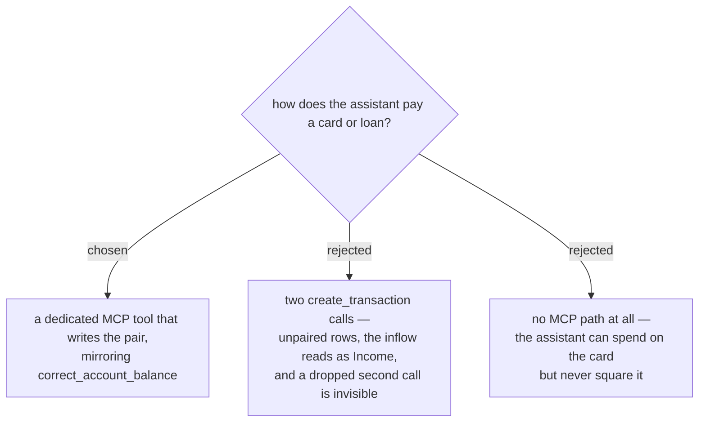

# The assistant pays through its own MCP tool

Decided rather than grilled: option B is not a design choice but a defect. `create_transaction`
writes one row against one `AccountId`, so the assistant paying by hand reproduces exactly the two
failures menunest-204 removed from the SPA — the inflow on the card carries no **Envelope** and is
counted as **Income**, and a call that fails or is never made leaves half a payment standing. The
tool is required for correctness, not added for convenience.

`BudgetTools` already sets this precedent: menunest-187 gave **Balance correction** its own tool
rather than letting the assistant reach the same state through a raw write, for the same reason.

The tool serves **Credit** and **Loan** **Accounts** alike, matching menunest-207 — one action, one
tool, one branch at the end.

## Consequences

- Deleting through MCP must honour menunest-209's pairing too; a payment is one thing to the
  assistant as it is to the **User**.
- Nothing else in `BudgetTools` changes. `create_transaction` against a Credit **Account** already
  does the right thing, because menunest-208 derives the **Payment envelope** from those rows
  rather than requiring the caller to place money anywhere.
