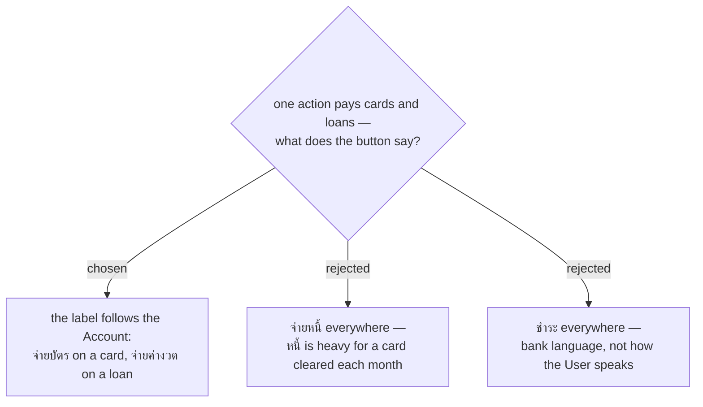

# The payment button's label follows the account type

Closes the naming question menunest-207 left open. One action, one command, one MCP tool
(menunest-211) — only the word on the button varies, resolved from the **Account**'s type at
render time. That costs nothing: no branch exists below the label.

The **Payment envelope** keeps the card-specific name **จ่ายบัตร &lt;account&gt;**, and needs no wider
one, because menunest-206 gives a **Loan** none.

_Avoid_, per CONTEXT.md: **จ่ายหนี้**, **ชำระ**, transfer, pay off, settle.
