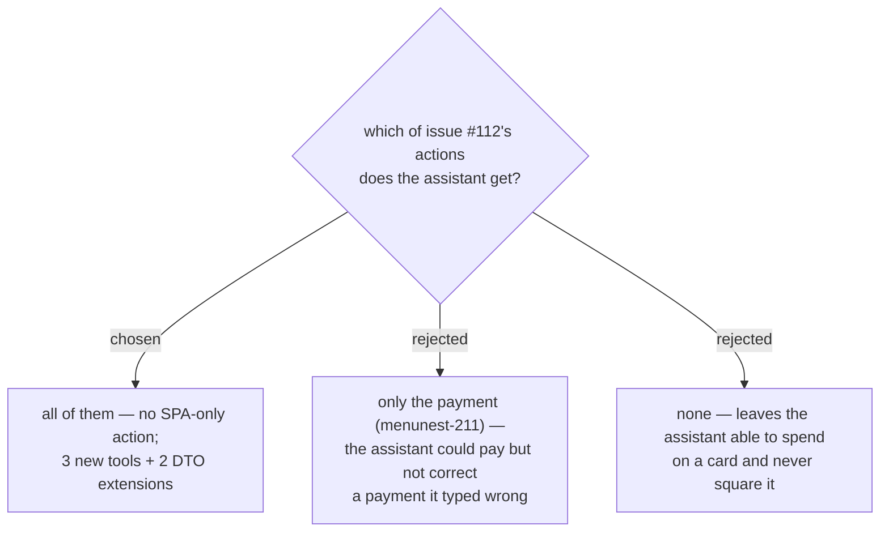

# Every function this feature adds is reachable over MCP

Widens menunest-211 from one tool to a rule, at the **User**'s instruction: every function this
feature adds is reachable over MCP. `BudgetTools` already carries 22 tools and the budget is the
module the assistant works in most, so an SPA-only action is a hole in a surface that is otherwise
complete.

Most of the feature needs nothing new, because a **Payment envelope** *is* a `BudgetCategory` and
the existing tools take a category id:

| function | tool |
|---|---|
| pay a card or loan | **new** |
| edit a payment | **new** — pairing-aware, per menunest-209 |
| delete a payment | **new** — pairing-aware, per menunest-209 |
| read the envelope and its shortfall | `get_budget_summary` — **extended** |
| read a card's shortfall | `get_budget_summary` — **extended**. NOT `list_budget_accounts`: see below |
| assign into a **Payment envelope** | `set_assigned_amount` — unchanged |
| move money in or out | `move_money` — unchanged |
| cover overspending from it | `cover_overspending` — unchanged |
| create / close a **Credit** **Account** | `create_budget_account` / `update_budget_account` — unchanged |

Editing and deleting a payment are separate tools rather than `update_transaction` /
`delete_transaction` on one half, because menunest-209 makes a payment **one row**: reaching a
single half is precisely the state that leaves the budget silently wrong.

menunest-205's refusals need no MCP work — `update_budget_category` and `delete_budget_category`
route through the same handlers as the SPA, so the guard covers both callers at once.

## Correction — `list_budget_accounts` is not extended, and says so

The table above originally listed `list_budget_accounts` as **extended** with a card's
`shortfall`. It is not, and cannot be. `shortfall` needs the month's **Payment envelope**
**Available** to compare the balance against, and only `GetMonthlySummaryHandler` has a `Year`/
`Month` to compute it in; `ListAccountsQuery` carries none, so `ListAccountsHandler` projects
`shortfall` as a hardcoded `null`. The `BudgetAccountDto` field is shared by both endpoints, which
is the only reason the column is there at all.

A null that means *"not computed here"* and a zero that means *"nothing owed"* are one keystroke
apart in an answer. An assistant asked *"how much do I still owe unfunded on my card?"* could call
this tool, read `shortfall: null`, and report **nothing owed** on a card short ฿20,000 — with no
error anywhere to contradict it. So the tool's `Description` now states plainly that `shortfall` is
always null from it, names `get_budget_summary` as the source for the real figure, and says not to
report a card as funded on the strength of the null. `BudgetToolsTests` pins that text, because the
description is the only thing standing between that null and a wrong answer.

## Consequences

- **Undo, Redo and the change history have no MCP tool today** — a pre-existing gap, predating this
  issue and unrelated to credit. It is out of scope here and wants its own ticket; folding it in
  would widen the PR beyond what #112 asks for.
