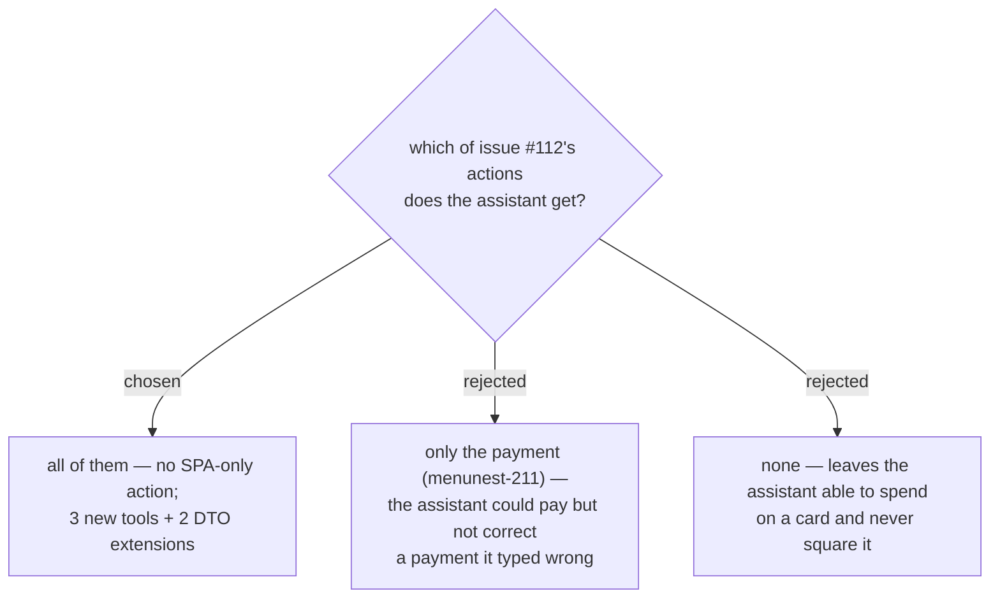

# Every function this feature adds is reachable over MCP

Widens menunest-211 from one tool to a rule, at the **User**'s instruction: every function this
feature adds is reachable over MCP. `BudgetTools` already carries 22 tools and the budget is the
module the assistant works in most, so an SPA-only action is a hole in a surface that is otherwise
complete.

Most of the feature needs nothing new, because a **Payment envelope** *is* a `BudgetCategory` and
the existing tools take a category id:

| function | tool |
|---|---|
| pay a card or loan | **new** |
| edit a payment | **new** — pairing-aware, per menunest-209 |
| delete a payment | **new** — pairing-aware, per menunest-209 |
| read the envelope and its shortfall | `get_budget_summary` — **extended** |
| read a card's shortfall | `list_budget_accounts` — **extended** |
| assign into a **Payment envelope** | `set_assigned_amount` — unchanged |
| move money in or out | `move_money` — unchanged |
| cover overspending from it | `cover_overspending` — unchanged |
| create / close a **Credit** **Account** | `create_budget_account` / `update_budget_account` — unchanged |

Editing and deleting a payment are separate tools rather than `update_transaction` /
`delete_transaction` on one half, because menunest-209 makes a payment **one row**: reaching a
single half is precisely the state that leaves the budget silently wrong.

menunest-205's refusals need no MCP work — `update_budget_category` and `delete_budget_category`
route through the same handlers as the SPA, so the guard covers both callers at once.

## Consequences

- **Undo, Redo and the change history have no MCP tool today** — a pre-existing gap, predating this
  issue and unrelated to credit. It is out of scope here and wants its own ticket; folding it in
  would widen the PR beyond what #112 asks for.
