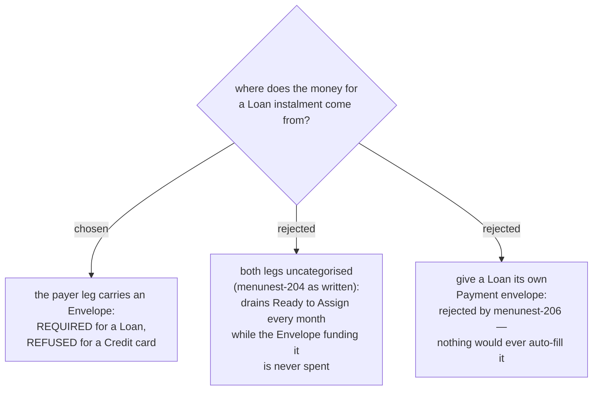

# A loan payment carries the envelope that funds it



**This corrects menunest-207.** menunest-207 said the money for a Loan instalment "comes from
whatever ordinary Envelope the User made for the instalment" — but the implementation it described
(menunest-204, Task 6 as originally written) made **both** legs of every payment uncategorised,
Credit and Loan alike. No Envelope was ever touched by a Loan payment. menunest-207 stated an
intent the design had no mechanism for.

## The defect, worked

```
cash 100,000 · "ผ่อนรถ" envelope 8,000 assigned / 8,000 available · loan −300,000
RTA before = 92,000 → pay 8,000 (both legs uncategorised) → RTA after = 84,000
ผ่อนรถ Available: still 8,000, forever
```

Every month the user assigns 8,000 to ผ่อนรถ (RTA −8,000) and then pays the instalment
(RTA −8,000 **again**, since the payment leg was uncategorised and so invisible to the envelope).
ผ่อนรถ's Available climbs to 16,000, 24,000, 32,000 — a phantom envelope that can never be spent —
against a Ready to Assign drained at twice the real cost of the loan. The Credit-card path in the
same handler is correct and holds RTA still on every activity, the payment included (menunest-204's
own acceptance test, `CreditRtaInvariantTests`); the Loan path's asymmetry from it was the tell.

**No test could have caught this as written.** The ledger identity
`RTA + Σ(Available) = Σ(non-debt account balances)` holds on both sides of the bad trace —
`92,000 + 8,000 = 100,000` and `84,000 + 8,000 = 92,000` — because the identity only checks that
money is conserved *somewhere* in the ledger, not that it lands in the envelope the user believes
is paying for it. The invariant survives untouched while the semantics underneath it inverts.

**There is no workaround.** Recording a loan payment by hand instead — two ordinary
`BudgetTransaction.Create` rows instead of `CreatePaymentLeg` — leaves the inflow leg with
`PaymentId == null`, so it slips past menunest-204's Income filter (`&& t.PaymentId == null`) and
reports the instalment as income. Every path to recording a loan payment was wrong until this fix.

## The fix

`BudgetTransaction.CreatePaymentLeg` gains a `Guid? categoryId` parameter. `MakePaymentHandler`
passes it to the **from-leg only** — the leg landing on the debt account itself stays uncategorised
unconditionally on both account types, exactly as before:

- **Loan**: `CategoryId` is **required**. A Loan has no Payment envelope of its own (menunest-206
  rejected giving it one — nothing would ever auto-fill it the way `PaymentEnvelopeMath` derives a
  card's), so the from-leg's Envelope is the *only* thing a loan payment ever spends. Refusing a
  null makes the defect impossible to reintroduce rather than merely documented against: a user who
  wants an RTA-funded instalment makes an Envelope for it, which is the app's existing model for
  every other kind of spending.
- **Credit**: `CategoryId` must be **null**. The card's Payment envelope already falls by
  derivation (menunest-208, `PaymentEnvelopeMath.Available`) purely from the uncategorised positive
  amount landing on the card — categorising the from-leg as well would spend one payment against
  two envelopes at once.

Re-run with the fix, same numbers:

```
cash 100,000 · ผ่อนรถ 8,000 assigned/available · loan −300,000 · RTA before = 92,000
pay 8,000, from-leg categorised to ผ่อนรถ
ผ่อนรถ Available = 8,000 − 8,000 = 0
RTA after = 92,000 − 0 = 92,000, unchanged — symmetric with the Credit-card case
```

## The remaining asymmetry, and why it is correct

A Credit payment is *refused* a category; a Loan payment *requires* one. This is not an
inconsistency to smooth over — it is the direct consequence of menunest-206 and menunest-208: a
card's Payment envelope is a derived quantity that the from-leg amount already feeds by being
uncategorised, while a loan has no such derivation to feed at all. Symmetry at the API surface
(“every payment optionally takes a category”) would have re-opened exactly this defect for Credit
by letting a category land on a card payment and silently drop its own Payment envelope's
derivation for that transaction.

## Narrowing the payer

`MakePaymentCommand.FromAccountId` may be a Credit account (paying one card with another —
menunest-214's sibling decision in Task 6, unaffected by this correction: the source leg is an
uncategorised **negative** row, which `PaymentEnvelopeMath.Available` never subtracts, so it only
widens the source card's own debt). It may **not** be a Loan: a Loan's balance is not spendable
money, so "paying" one loan from another would write a meaningless uncategorised row with no real
money behind it on the source side.
