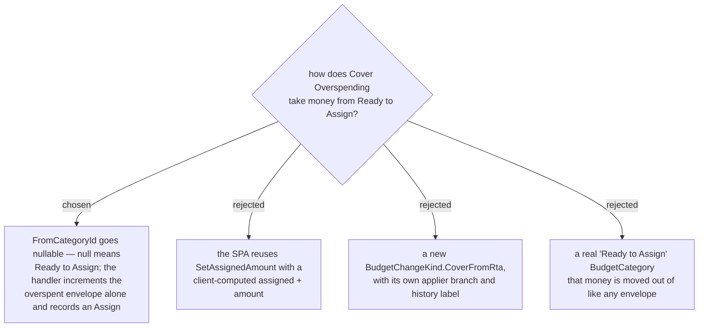

# Covering an overspend from Ready to Assign is a one-sided assign

Issue #115: an **Envelope** was overspent by ฿110 while ฿893.81 sat unplaced, and **Cover
Overspending** offered no way to use it. The source list was **Envelope**s only, so the one
obvious source — money that has not been given a job yet — was the one source missing. The
**User** had to assign it somewhere first and then move it, or conclude the app had lost it.

**Ready to Assign** is derived. `GetMonthlySummaryHandler` computes it as
`sum(accounts) − sum(envelope.available)`; it owns no `MonthlyAssignment` row and no
`BudgetCategory`. So covering *from* it cannot be a transfer between two rows the way every
other cover is. It is a **one-sided increment** of the overspent **Envelope** — and because
the derived figure subtracts every **Envelope**'s **Available**, raising one by ฿110 is exactly
what makes **Ready to Assign** fall by ฿110. Nothing else has to happen.

`CoverOverspendingCommand.FromCategoryId` therefore becomes `Guid?`, where **null means Ready to
Assign**. A `Guid.Empty` is still refused: that is a caller that meant to name an **Envelope** and
sent nothing, and letting it through would silently mint money instead of failing loudly.

## The act is recorded as an `Assign`, not a `Cover`

A `Cover` row means "this **Envelope** gave, that one received": it carries the source in
`CategoryId` and the destination in `SecondCategoryId`, and `BudgetChangeApplier` refuses one
whose destination is null. There is no giving **Envelope** here.

Recording an `Assign` is not a lossy substitute — it is the accurate record. Moving money out of
**Ready to Assign** into one **Envelope** *is* an assign, indistinguishable in effect from typing
the figure into that **Envelope**'s **Assigned this month** box. It undoes and redoes through the
existing single-**Envelope** delta branch, so option C buys a new enum value, a new applier
branch, a new history label and a migration in exchange for a distinction the ledger cannot
honestly draw.

## Why not let the SPA do it (option B)

`SetAssignedAmountHandler` calls `MonthlyAssignment.SetAmount` — an **absolute** figure. The SPA
would have to compute `overspent.assigned + amount` from the summary it last rendered, so a
concurrent assign by another **Family** member between that render and the tap would be
overwritten wholesale. menunest-193 exists precisely to stop that: every budget write applies a
**delta** so a concurrent change survives it. The handler uses `AdjustAmount(+amount)`, as every
cover and move already does, and records the delta — undo included.

## Why not a real Ready to Assign envelope (option D)

It would make the source list uniform, at the cost of making `readyToAssign` both a stored
**Envelope** and a derived figure that subtracts every **Envelope**'s **Available** — including
its own. menunest-182/183/208 have already settled that a stored figure and its derivation drift
apart; this one would not merely drift, it would be self-referential.

## Consequences

- The **Cover Overspending** source list leads with **Ready to Assign** whenever it is strictly
  positive (`coverSourceOptions`), then the **Envelope**s with spare cash. The `> 0` gate is a UI
  choice, not a mirrored server refusal — the server still allows over-assigning, and
  `RtaHero`/`SuggestedFixCard` already treat a negative **Ready to Assign** as a designed,
  recoverable state. Offering an empty or overdrawn **Ready to Assign** as a *source* would just
  be nonsense at the moment of choosing.
- Covering more than **Ready to Assign** holds is allowed and drives it negative, exactly as
  assigning too much always has. The amount is shown on the option so the **User** can see what
  they are spending.
- A cover from **Ready to Assign** appears in the history sheet as `ใส่ ฿110 เข้า ค่าซักผ้า`, not
  as a cover line. That is what happened.
- The everyday re-freeze guard (menunest-181/189) now turns only on the overspent **Envelope**
  when the source is null — a null source can never match an `IsEveryday` row.
- The MCP `cover_overspending` tool takes a nullable `fromCategoryId` with the same meaning, so
  the assistant can place unassigned money without a two-step assign-then-move.
