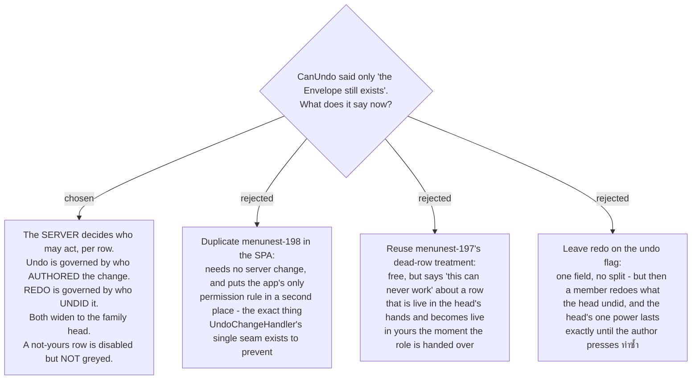

# menunest-216: `CanUndo` carries both rules, and redo belongs to whoever undid it

**Date:** 2026-09-01
**Status:** Accepted
**Relates to:** issue #108 (`Refs #106`); decision-map `undo-permission-108`, tickets `blocked-row-treatment`, `rail-reach-past`, `redo-symmetry`. Extends menunest-197 (what `CanUndo` meant) and menunest-198 / menunest-201 (who may act). Reads against ADR-145 without amending it.



## Context

`ListChangesHandler` discarded its caller and computed `CanUndo: !gone`, where `gone` is
menunest-197's deleted-Envelope case. That was honestly named and honestly documented — and
three SPA consumers read it as if it also carried menunest-198: both buttons on the Change
history sheet, the row's `is-dead` class, and the shortcut rail's two targets.

The consequence is issue #108: an ordinary member sees an **enabled** Undo on another
member's row, presses it, and gets `DomainException("You can only undo your own changes.")`.
Prod is dormant on this — 2 families, 1 member each, measured 2026-08-29 — and it breaks the
first time a second person joins.

Charting it found two things the issue did not name. `undo-permission-108`'s audit ticket
holds the measurements; this ADR holds what was decided.

## Decision

### 1. The rule moves into the server's `CanUndo`, and nowhere else

`ListChangesHandler` takes the caller it already resolves, reads `Family.HeadUserId` **once**
outside the row loop, and computes permission per row. The SPA gains no `isHead`, no user-id
comparison and no copy of menunest-198.

This is not a preference. menunest-198's rule lives in one seam by design —
`UndoChangeHandler`'s own comment says *"do not scatter the rule"* — and the head check
already exists twice server-side (`UndoChangeHandler`, `RedoChangeHandler`), so this is a
third copy of a query that works: one extra round trip per history load, no migration, no new
endpoint, no new `DbSet`.

### 2. Undo is governed by who authored the change; redo by who undid it

This is the ADR's substantive finding, and it is not what the issue proposed.

| act | permitted when |
|---|---|
| **Undo** | `row.UserId == caller` — you may undo your own — **or** caller is the head |
| **Redo** | `row.UndoneByUserId == caller` — you may redo what *you* undid — **or** caller is the head |

The issue's suggested formula governs both on `row.UserId`, which leaves this live: the head
undoes my change, the row is still mine, so I redo it, and they undo it again. menunest-201
gave the head exactly one power; on the author-governed formula that power lasts until the
author presses ทำซ้ำ.

**The head's undo sticks.** `BudgetChange.UndoneByUserId` is already stored and already
projected, so the rule costs a field comparison. The symmetry is the point: *you may reverse
what you did* covers both directions, and the head's widening applies to both.

`RedoChangeHandler` changes with it — its check moves from `change.UserId` to
`change.UndoneByUserId`. That is a real behaviour change, not only a DTO one.

### 3. The DTO carries four fields, because two states are not one state

```csharp
bool CanUndo, bool CanRedo, bool IsDead, string? BlockedReason
```

- **`CanUndo` / `CanRedo`** disable the two buttons independently. A single flag cannot
  express decision 2, and `latestRedoable` must stop reading the undo flag.
- **`IsDead`** is menunest-197's case alone: the Envelope is gone and no one, head included,
  can ever act on this row. It is the **only** thing that greys the row.
- **`BlockedReason`** explains whichever button is off. One field is enough because a row
  shows either ยกเลิก or ทำซ้ำ, never both.

`IsDead` exists so the SPA never has to infer the reason from the reason **string**. ADR-145
established that the SPA does not match backend strings; that holds here.

### 4. A not-yours row is disabled but not greyed

- **Greyed (`opacity:.55`) stays reserved for `IsDead`.** A deleted Envelope is permanent and
  true for everyone. "Not yours" is temporary and false for the head standing next to you.
- **A not-yours row renders at full strength** with its button disabled and a reason line in
  `var(--text-muted)` — a new `.bdg-history-note`, not `.bdg-history-blocked`'s `var(--red)`.
  Red is an alarm; being asked not to touch somebody else's money is not one.

The row already prints its author's name one line above, so the reason names the head rather
than repeating the author: *"Only the family head can undo someone else's change."*

### 5. `BlockedReason` stays English

Every string the sheet composes is Thai; `BlockedReason` arrives in English and is printed
verbatim. **ADR-145 does not settle this** — it rules on messages *thrown* from the backend
and says the line is "where the string is authored", and `BlockedReason` is display copy on a
DTO that nothing throws. The gap is real and it is now confirmed as deliberate: the new
reason is English, matching menunest-197's existing one.

The alternative worth naming: turning `BlockedReason` into a code the SPA renders in Thai.
That is the shape ADR-145 rejected for exceptions, on a far smaller surface — plausible, and
declined because it makes the DTO a contract the SPA must keep in step for two sentences.

### 6. The rail reaches past another member's newer change, silently

`latestUndoable` takes the newest row with `!isUndone && canUndo`, so once ownership is in
that flag the rail skips a colleague's newer change and arms on the member's own older one.
**That is the accepted behaviour**: the rail always undoes the newest thing *you* may undo.

It is chosen, not inherited. menunest-197 accepted that the rail "can look pressable and then
refuse" for a case it called rare; in a two-member family roughly half the rows are somebody
else's, so that acceptance did not already cover this. The cost is named: press Undo, and you
may reverse something from two days ago with no indication the newest change was passed over.

Rejected: **stopping at the newest row** — honest, but the rail goes dark whenever a
colleague is active, which in a two-person family is often. **Announcing what it did** — needs
a surface the app does not have; there is no shared toast system.

The head is unaffected either way. Every row is theirs, so their rail behaves exactly as today.

## Consequences

- **`latestRedoable` must read `canRedo`.** It is a one-word change in a module with a real
  vitest suite, and it is the only place the flag split reaches the SPA's logic.
- **Nothing existing should turn red.** The change only narrows: every `ListChangesHandlerTests`
  case calls as `fx.User`, who created the family and is therefore its head, and
  `budget.shortcut-rail.spec.ts` runs on a fixture whose rows all belong to `user-1`. A red
  test means the change went wider than intended.
- **The rendering half must be covered by Playwright.** CLAUDE.md: vitest runs in
  `environment: 'node'`, so nothing but e2e can see a greyed row or a disabled button, and
  the review gates are blind to visual fidelity. The history response is fully mocked at
  `frontend/e2e/helpers/mockRoutes/budgetRoutes.ts`, so a foreign row is a fixture edit — the
  fixture already names a second member, `มาลี`.
- **The backend half is unit-testable without a two-member prod family.**
  `HeadUndoesAnyoneTests` already seeds a second and third member. Trap: `fx.User` is the
  head, so a test that does not repoint `fx.UserProvisioner` is silently testing the head.
- **The runbook's "needs a two-member family" blocker survives only for prod verification** —
  a real member seeing a real disabled row. It is not a blocker on the build.
- **A former head's rows become undoable by nobody but the current head.** `Family.HeadUserId`
  can point at a member who left, and menunest-201's `LeaveFamily` guard only stops the *head*
  leaving while others remain. Left open on the map's fog rather than solved here.
- **If undo/redo ever reach MCP**, `CanUndo`/`CanRedo` stop being the only thing a client can
  trust and the rule needs a second enforcement point. Carried over unanswered from
  `shortcut-rail-106`.
