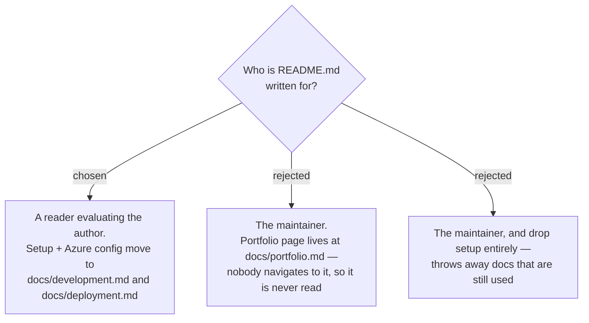

# The root README is the portfolio front door; operational docs move to `docs/`

GitHub opens `README.md` and nothing else when someone follows a repo link, so the root
README is the only page a reader evaluating this project is guaranteed to see. It is
therefore written for that reader: what the system is, what it demonstrates, and what
it looks like running.

The operational content it previously carried — local-dev prerequisites, the setup
commands, the App Service / Static Web Apps settings tables, and the Entra ID app
registration steps — is not deleted. It moves to `docs/development.md` and
`docs/deployment.md`, both linked from the README, and stays the source of truth for
running and deploying the app.

## Consequences

- Anything added to the README from now on is judged by whether an outside reader needs
  it in the first screen. Operational detail belongs in `docs/`, not here.
- Version numbers and counts quoted in the README (framework versions, tool counts, test
  counts) are load-bearing claims a reader can check against the source. They must be
  verified against the tree when written and re-verified when the README is next touched
  — the pre-existing "React 18" claim was wrong against a `package.json` pinning React 19.
