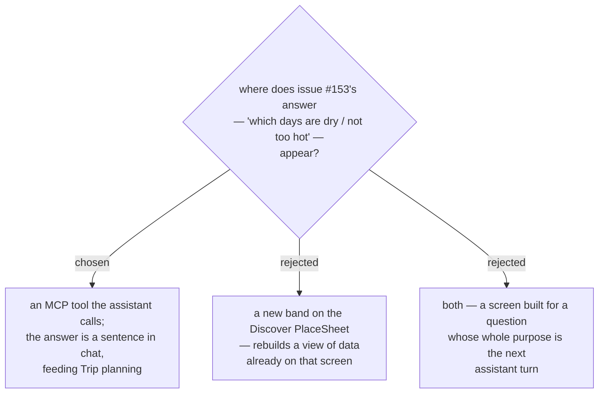

# The good-weather answer is an MCP tool for the assistant, not a Discover surface

Issue #153 is written as a sentence a person says — "Give the location. Is there any day that is
not raining for this place?" — and the **User** confirmed the goal: give a location, learn which
days are good, then **plan a Trip**. Trip planning already happens through the assistant, so the
answer is consumed by the assistant's next turn, not by a reader looking at a screen.

**Discover** was rejected because the data is already there. The `PlaceSheet` auto-renders 48 h of
the **Hourly forecast** on every **Place** selection (menunest-123). A second band on the same
sheet would restate what the strip shows, while still stopping at 48 h. The real gap is different:
nothing in MenuNest reads the **whole** 10-day **Forecast horizon** and reduces it to an answer.

## How the User gives the location

The tool takes `lat` / `lng`, not a name or a URL. The assistant already resolves a location with
`resolve_place` (a Google Maps URL or a name → coordinates) before calling `add_trip_place`; this
tool joins the same chain rather than growing a second resolver.

This closes a real asymmetry in the MCP surface: `get_stop_weather` already accepts arbitrary
coordinates (its `stopId` is an opaque echo key, never checked against the DB), and
`POST /api/trips/weather/hourly` accepts raw `lat`/`lng` over HTTP — but the only **MCP** door onto
the **Hourly forecast**, `get_stop_hourly_forecast`, demands a `tripId` and a `stopId`. So today
the assistant cannot read hourly weather for a place the **User** has not already saved into a
**Trip** — which is exactly the moment issue #153 describes.

## Consequences

No new screen, no mockup, and no frontend work. In exchange, the **Discover** `PlaceSheet` keeps
showing only 48 h: a **User** browsing the map still cannot see that day 8 is the dry one without
asking the assistant.
