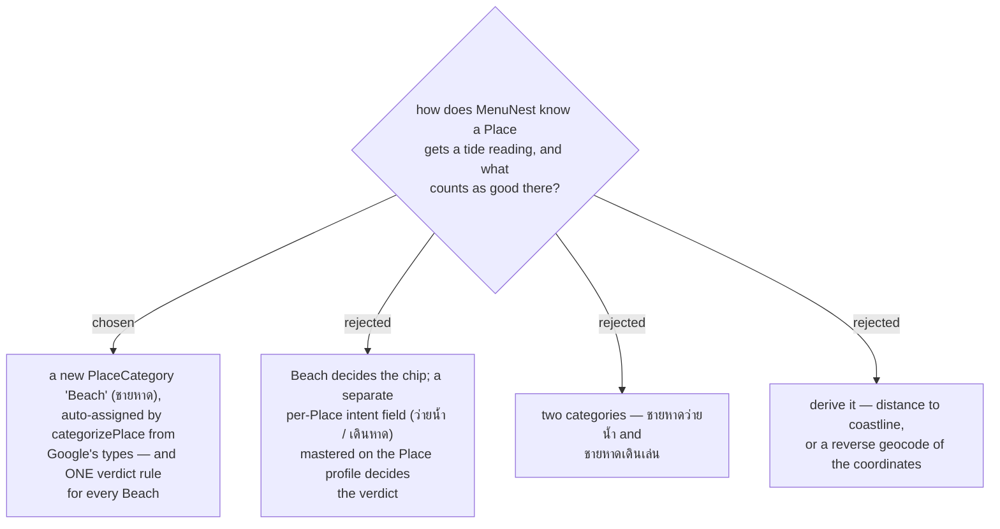

# A beach is a Place category, and that category alone fixes the tide verdict

Issue #135, decision map #138, ticket #142. This also answers ticket #140 (coastal detection).

`PlaceCategory` is today `Stay, Eat, See, Cafe, Shop, Other`. A beach is `See` or `Other`, so there
was nothing to key a tide reading off. **A **Place** gets a tide reading when its category is
`Beach`.**

The mechanism costs almost nothing because it already exists. `categorizePlace` (`lib/placeCategory.ts`)
maps Google Places types to a category at **Capture** time, so `Beach` is assigned automatically for
the two MVP-primary **Capture** paths — live search and map-tap. A coordinate **Place** carries no
Google types and falls to `Other`, exactly as every other category already behaves there, and the
**User** sets it by hand from the category control the **Place** editor already has.

*(Whether Places API (New) exposes a `beach` type is not asserted here. It is on ticket #145's
checklist. If it does not, `Beach` is still a category the **User** sets by hand and nothing else in
this ADR changes — only the automatic assignment is lost.)*

## Why derivation lost (option D)

menunest-016 already rejected reverse-geocoding an arbitrary tapped point, and menunest-163 shipped
**Capture mode**'s empty-ground rule specifically by *keeping the raw coordinates and letting the
**User** name the place*, so that no Geocoding call is made. Deriving coastal-ness from a reverse
geocode would reintroduce the call that decision removed. A distance-to-coastline test needs a
coastline dataset that MenuNest does not have and would not otherwise want.

## Why one rule, and not a per-Place intent (option B)

**The purpose is concrete: walking the beach and playing in the sand with a child.** That is what
the **User** stated this feature is for. Low tide is what that wants, every time — more exposed sand,
more beach to walk, shallower water at the edge. There is no competing intent to arbitrate.

This is what makes one fixed rule *correct* rather than merely cheap. Option B exists to settle a
conflict between "low tide is good" (walking, tidepools, sandbars) and "high tide is good"
(swimming) — and for this app that conflict does not arise. A swimming-beach verdict is not a use
case, so a per-**Place** intent field would be a mechanism with one value in it forever.

It has a clean precedent if it is ever needed: **Best-time window** and **Season period** are both
optional per-**Place** value objects, mastered on the **Place profile**, with a **Per-trip override**,
and a tide preference would be the third such axis. That path is written down here so it does not
have to be rediscovered. But it is **out of scope**, not merely deferred: it would cost an EF
migration, a **Place**-editor field, a **Seed-on-capture** path and a glossary term to express a
distinction the **User** does not have.

menunest-217 keeps the raw tide height on the chip anyway, so a **User** whose purpose ever does
change is not stranded — they can read the number and judge for themselves.

Option C — pushing intent into the category axis — was rejected outright rather than deferred. A
category answers *what kind of place this is*; what the **User** intends to do there is a different
axis, and merging them means the same physical beach is two different categories depending on the
trip. `categorizePlace` could not choose between them from Google's types either, so it would also
destroy the automatic assignment that makes option A cheap.
