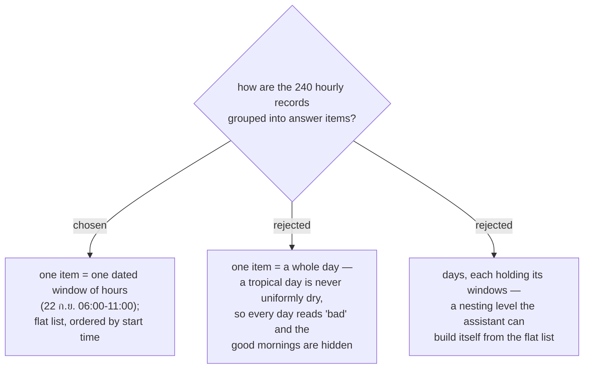

# One answer item is a dated window of hours, returned as a flat ordered list

Issue #153 asks in two units at once: "วันไหนฝนไม่ตก" is a **day**, "ช่วงเวลาที่ดีที่สุด" is a
window of hours. The **User** chose the window as the item, in a **flat** list ordered by start
time — not grouped under a day.

A day-level verdict was rejected as *false*, not merely coarse. Take ปาย in August: every one of
the 10 days carries an afternoon rain chance near 70 %, and every morning is dry. A tool that must
judge the whole day answers "ไม่มีวันไหนฝนไม่ตกเลย" — which hides ten good mornings and cannot be
planned against. The **Hourly forecast** carries one record per hour (menunest-119); collapsing to
a day throws that resolution away before the **User** ever sees it.

Day grouping was rejected as a *presentation* concern. The flat list already carries each window's
date, so the assistant can group by day in its reply whenever that reads better. Nesting it in the
payload would fix one presentation in the contract and make the common case — "give me the next
good window" — a two-level walk.

## Consequences

The result length is unbounded in principle: a 10-day horizon at a place with a twice-daily good
spell yields roughly 20-30 windows. The tool therefore needs a way to keep a reply readable — a
window count cap, a shorter default horizon, or a minimum window length that drops one-hour gaps.
That is a separate decision, still open at the time of writing.

A window is contiguous by construction, so the rule that decides whether a single **hour** is good
is what generates the windows. That rule — and whether its thresholds come from the **User**'s
existing **Weather-alert threshold** — is also a separate, still-open decision.
