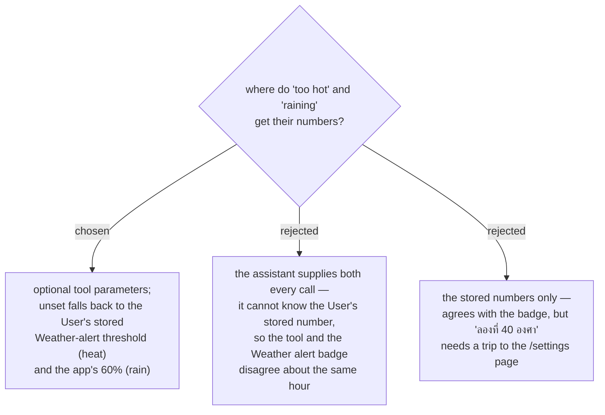

# The good-hour thresholds default to the User's Weather-alert threshold, and are overridable per call

The **Weather-alert threshold** is already the **User**'s own answer to "what is too hot": stored
per-User on `UserSettings.FeelsLikeWarnThreshold`, set on the `/settings` page, `null` = the
built-in default of 40 °C, `0` = off (menunest-091). Issue #153 asks the same question in different
words, so it must resolve to the same number or the product contradicts itself.

The contradiction is concrete. A **User** travelling with a small child sets 38 °C. If the new tool
hardcodes 40 °C, it reports a 39 °C hour as good while the **Weather alert** badge on that same
**Place** flags it as too hot — one product, two answers, no error anywhere to reveal it.

The thresholds stay **overridable per call** because trip planning is a conversation: "ลองที่ 40
องศา ก็ได้" must work in one sentence, without leaving the chat to edit `/settings`.

## Notes

This is the **first** backend use of the **Weather-alert threshold**. Until now the backend only
stored and range-validated the two numbers (`UvWarnThreshold ∈ [0,15]`,
`FeelsLikeWarnThreshold ∈ [0,60]`); every evaluation lived in the web app, in
`frontend/src/pages/trips/lib/weather.ts` (`effectiveThreshold`, `weatherAlertBadges`). The
`null` = default / `0` = off encoding must therefore be reimplemented server-side, and it is a
**third** copy of a rule after `weather.ts` and the settings-page helpers — a divergence risk the
spec has to name, in the same way `WeatherHourSelection.CoolestHour` is already the server twin of
the client's `coolestHour`.

Rain has **no** User-scoped setting to inherit. Its default is the web app's existing
`RAIN_TINT_THRESHOLD = 60`, reused so that "raining" means one thing across both surfaces. Whether
rain should *become* a stored **Weather-alert threshold** is deliberately out of scope here.

`0` = off carries through: a **User** who turned the heat alert off is asking for no heat gate at
all, so heat stops filtering the windows rather than falling back to 40 °C.
