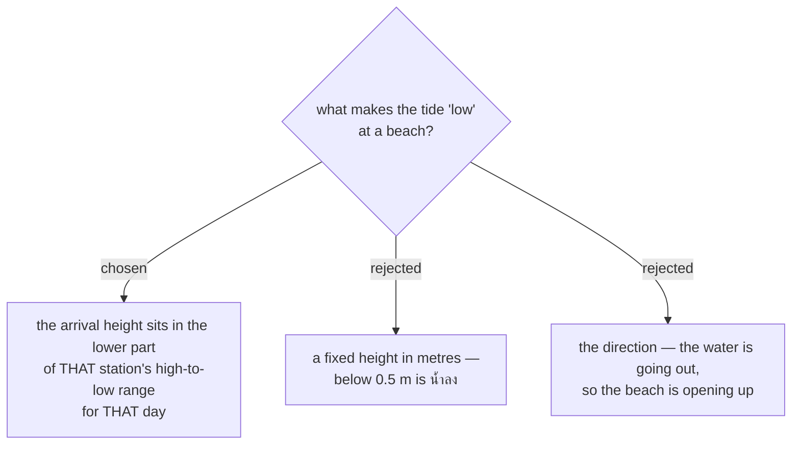

# Low tide is relative to that station's own daily range

Issue #135, decision map #138, ticket #142.

Thai stations have very different tidal ranges, so an absolute threshold does not transfer between
them. Worked example, both at 15:00:

| station | that day's range | height at 15:00 | what a visitor sees |
|---|---|---|---|
| หาดบานชื่น (ตราด) | 0.2 – 2.6 m | 0.4 m | water almost fully out |
| near Bangkok Bar | 1.0 – 3.8 m | 1.2 m | water almost fully out |

A fixed `< 0.5 m` rule calls the first **น้ำลง** and the second **น้ำขึ้น**, though the two beaches
look identical to someone standing on them. The rule would have to be tuned per station, which is a
tuning table for 19 stations that nobody will maintain.

## It also defuses the datum question

Map #138 was carrying the datum choice as an open decision: WorldTides defaults to **MSL**, where a
low tide can be negative, while chart datum (**LLW**) puts low tide near zero. A fixed-height rule is
extremely sensitive to that choice — the same beach reads differently under each.

A relative rule barely cares. Both endpoints of the range move together, so the position of the
arrival height *within* the range is nearly unchanged. **WorldTides' MSL default is therefore
acceptable and this ADR does not force LLW.** That is a decision the map no longer has to make.

## The cost, and why direction was not enough

The relative rule needs the day's high and low, not just the height at arrival — so a **Beach**
**Stop** costs the day's extremes as well as the arrival height. Tides are deterministic and cached
by `(station, date)` and served to every **User** from that one cache, so this is a one-off per
station-day and not a per-**User** cost.

Option C — judging on rising versus falling — avoids thresholds entirely and is cheapest of all, but
it answers the wrong question. "The water is going out" says nothing about how much beach there
actually is at 15:00, which is what the **User** is trying to find out.
