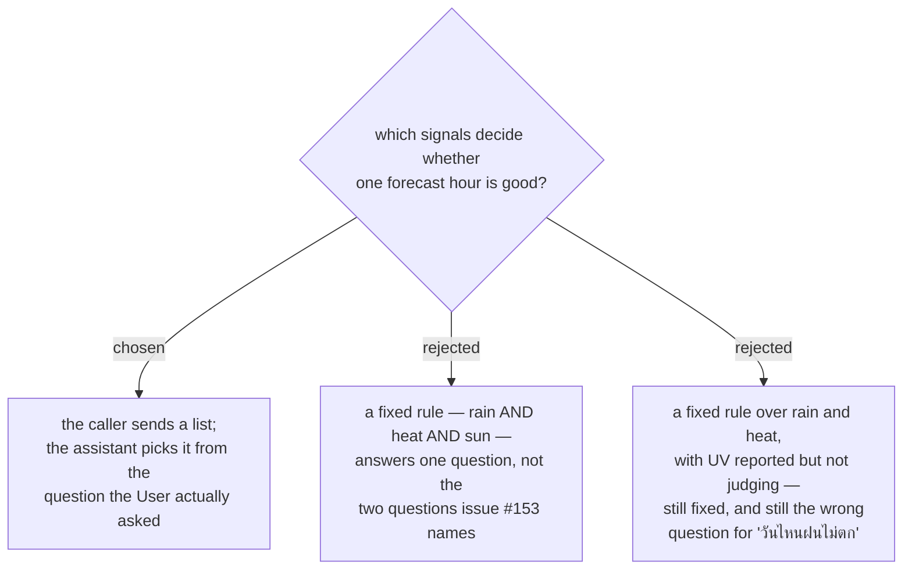

# The caller selects which signals judge an hour; the tool has no fixed rule

Issue #153 does not ask one question. It asks two — "วันไหนฝนไม่ตก" and "วันไหนแดดไม่ร้อน" — and
the **User** confirmed that the values which judge an hour follow whichever one was asked. So the
signal set is a **parameter**, not a constant.

A fixed rule is not merely coarse here, it is wrong. Asked "วันไหนฝนไม่ตก", a rain-AND-heat rule
drops a cool, overcast, rainy-adjacent hour that perfectly answers the question. Asked
"วันไหนแดดไม่ร้อน", the same rule drops a rainy hour — when rain is precisely what makes the sun
weak, and therefore a *good* answer. Every fixed rule answers a question the **User** did not ask.

This composes with menunest-219 rather than replacing it: the list says **which** signals judge, the
**Weather-alert threshold** still says **what number** each one uses.

## Consequences

An empty signal list means nothing judges, so every hour in the horizon is "good". The spec must
decide whether that is a validation error or a legitimate "just show me the forecast" call.

The tool's usefulness now depends on the assistant choosing the list correctly from Thai phrasing.
That mapping lives in the tool's `Description` — the only place an MCP client reads intent from —
so the description carries worked examples, and a test pins its text, as `BudgetToolsTests` already
does for `list_budget_accounts` (menunest-213).
