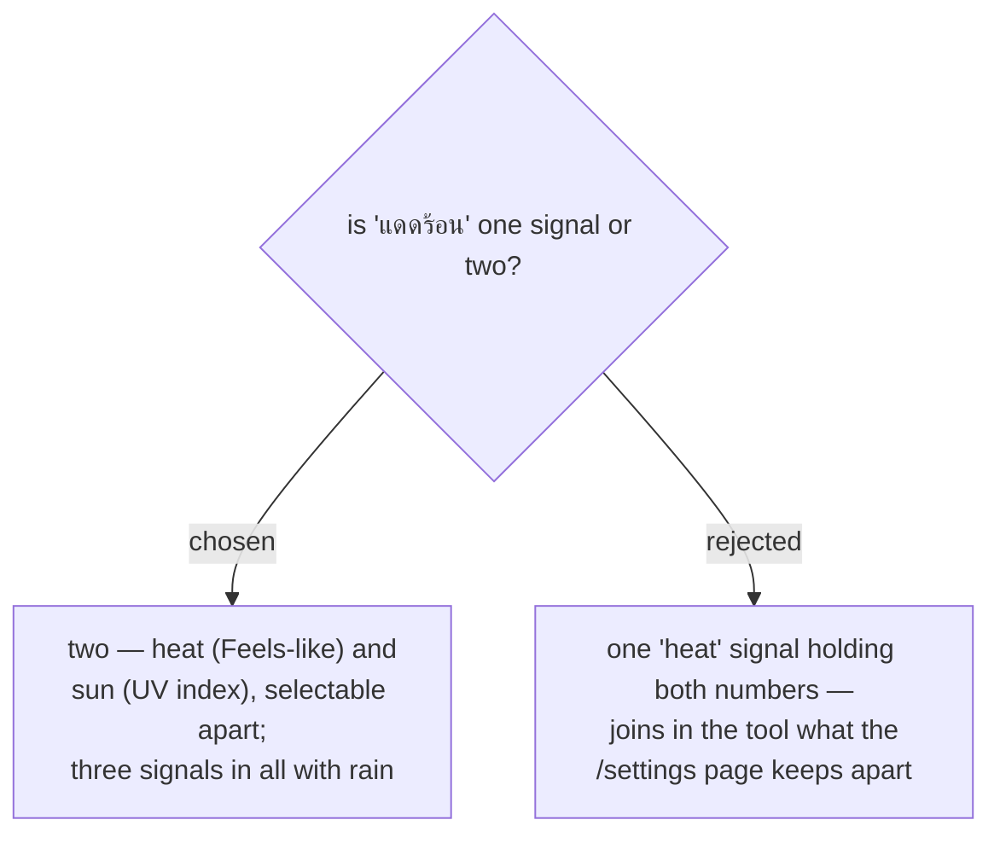

# Heat and sun are two separate signals, not one combined "แดดร้อน"

`CONTEXT.md` defines the **Weather-alert threshold** as "**two independent thresholds** — a **UV
index** one and a **Feels-like** one — each settable to a value or turned **off**" (menunest-091).
A **User** can already turn the heat alert off and keep the sun alert on. Folding them into one
signal would make the new tool disagree with the settings page about what is one choice and what is
two.

Thai separates them as well: "ร้อนไหม" and "แดดแรงไหม" are different questions, asked by people
worried about different things — heat exhaustion versus a child's skin.

Nothing is lost, because "แดดไม่ร้อน" in ordinary speech means both: for that phrasing the
assistant simply sends both signals. So the signal set is `rain` (rain %), `heat` (**Feels-like**),
and `sun` (**UV index**).
