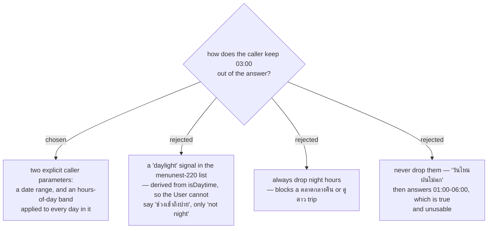

# The search is bounded by a date range and an hours-of-day band, not a daylight signal

menunest-220 let the caller choose *which signals* judge an hour, and that created a hole: asked
"วันไหนฝนไม่ตก" with only `rain` judging, the driest hours of a Thai day are 02:00–05:00, so the
honest answer is a 03:00 window nobody can plan a **Trip** around. The **User** chose to close it
with an explicit time parameter rather than a daylight flag.

**Both** bounds are taken, because they fix different problems:

| parameter | what it bounds | fixes |
|---|---|---|
| date range | which days of the **Forecast horizon** are searched | "เสาร์อาทิตย์หน้า" — otherwise the caller must convert a weekend into an `hours`-from-now count, and still gets windows starting today |
| hours-of-day band | which hours of **each** searched day are searched | the 03:00 window |

Neither alone answers "เสาร์อาทิตย์หน้า ไปปาย ช่วงเช้าถึงบ่าย วันไหนฝนไม่ตก".

The date range also replaces the `hours` (1–240) parameter that `get_stop_hourly_forecast` and
`GetHourlyForecastQuery` take. An hours-from-now count is the wrong unit for planning: the
assistant has to do date arithmetic to express a weekend, and the result still leads with today.

## This does NOT weaken menunest-117

menunest-117 states that **isDaytime** is "the canonical daytime/nighttime split … **never a fixed
clock**". The hours-of-day band *is* a fixed clock, so the distinction has to be stated plainly and
kept:

- **isDaytime** answers *what daytime is* — a fact about sunrise and sunset at that point, which
  varies by latitude and season. It stays the only source for that, and the coolest-daytime /
  coolest-nighttime quick actions keep using it.
- The hours-of-day band answers *when the **User** wants to be out* — a preference. 08:00–18:00 is
  not a claim about daylight.

A later reader who treats the band as a definition of daytime breaks menunest-117. The spec and the
tool description must both say so.

## Consequences

Every parameter stays optional, and the no-parameter call must still answer the plain question
"วันไหนอากาศดี" sensibly, because the tool is now wide: `lat`, `lng`, the signal list, three
threshold overrides, a date range and an hours-of-day band.

Two edges are left for the spec: whether the hours-of-day band may cross midnight (18:00–01:00 for
a ตลาดกลางคืน), and what a date range that runs past the 10-day **Forecast horizon** returns —
**No weather data**, a silent truncation, or an explicit note that the tail was not forecastable.
