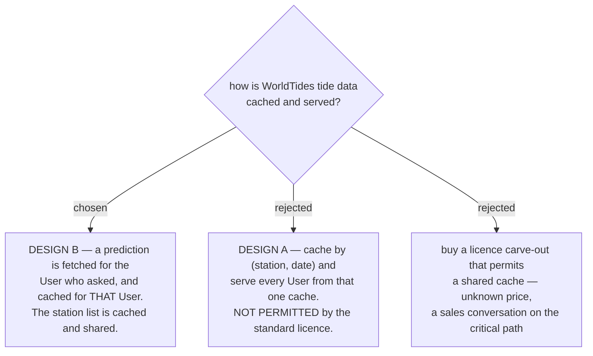

# Tide predictions are fetched per User, because the licence says so

Issue #135, decision map #138, ticket #145. **This supersedes the Design A note recorded on the map
and on #139 on 2026-09-05.**

Tides are deterministic, so a shared cache keyed by `(station, date)` is the obvious engineering
answer: 19 Thai stations x 53 weeks x 2 call types is about 2,000 credits a year, roughly **USD 1**,
and flat however many **User**s arrive. That is Design A, and the map chose it.

**WorldTides does not permit it.** Their own pages, verbatim:

> **developer page:** "In general, applications should request fresh predictions for each unique user
> request rather than storing one response and redistributing it to multiple users." … "You may cache
> a prediction for the individual user who requested it and display it to that same user more than
> once. You may also cache and share the station list, which is useful for maps, location search, and
> station proximity checks."

> **apidocs:** "Each API request may only be used for a single user except where the license
> explicitly allows otherwise."

> **terms:** "You may not resell WorldTides data as a standalone dataset, bulk database, or competing
> tide API without written permission."

The `/terms` sentence "You may cache results for performance and reliability when doing so is
reasonable for your application" reads permissively in isolation, and that is how the map first read
it. The developer page is the specific rule and it governs: **the cache is per-**User**, not shared.**

## What Design B actually is

- A prediction is fetched for the **User** who opened the **Trip**, and cached **for that User**.
- The **station list** is explicitly carved out and **may** be cached and shared across every **User** —
  which is what a **Beach** **Place** needs to find its nearest station, so station lookup stays free.
- Cost scales with **User** count rather than station count: roughly 10 credits per **Trip** with five
  coastal **Stop**s, so about USD 0.005 per **Trip**.

## Why this was not a budget decision

MenuNest's telemetry showed a single active **User**. At that size Design A and Design B both cost
cents per year, and an earlier framing on this map that called the cost case "decisive" was wrong —
the map carries a note saying so, and it stands. **The difference was always which design is
permitted, and now that is settled.**

Option C — buying the "except where the license explicitly allows otherwise" carve-out — was rejected
because it puts a sales negotiation of unknown length and price on the critical path to buy a saving
that rounds to zero at this scale. It remains available if MenuNest ever has enough **User**s for the
per-**User** cost to matter, and the shape of Design A is recorded here so it need not be rediscovered.

## What is still unsettled

WorldTides publishes **no maximum future date** anywhere public — the only documented range limit is
`1 to 7 days`, and it applies solely to `plot` requests, not to `heights` or `extremes`. Dates past
31 December were the whole reason WorldTides was chosen over the Thai Hydrographic Department tables
(menunest-218's sibling decision on #139), so this must be probed on a live key. **If it fails, the
source decision itself is revisited, not worked around.**
