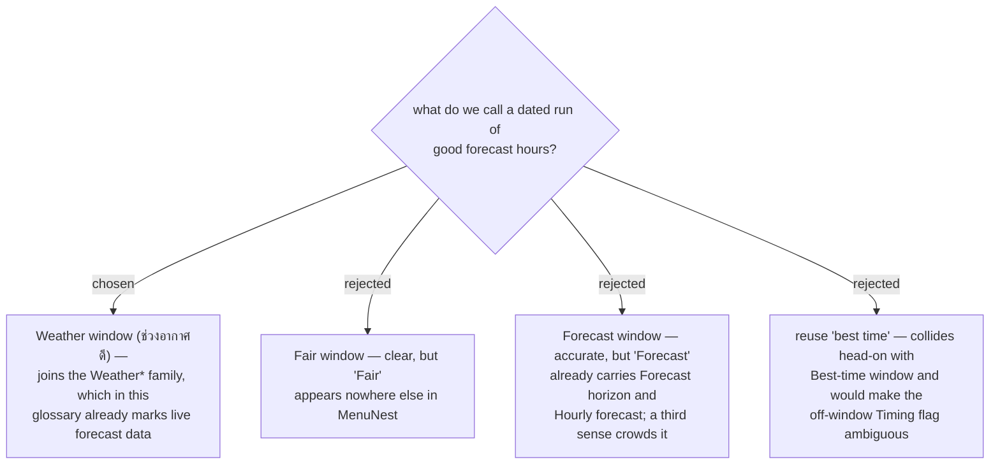

# The new term is Weather window, not a second kind of "best time"

Issue #153 asks for "ช่วงเวลาที่ดีที่สุด", which sounds exactly like the **Best-time window** that
`CONTEXT.md` already defines. They are not the same thing, and the glossary's own `_Avoid_` line
for **Best-time window** already warns against the bare phrase "best time".

| | **Best-time window** | **Weather window** |
|---|---|---|
| who makes it | a person types it on a **Place** | derived from the **Hourly forecast** |
| dated | no — it repeats every day | yes — 22 ก.ย. 06:00–11:00 |
| stored | JSON on the **Place** and its **Place profile** | nothing is stored (ADR-033) |

`Weather` is the discriminator this glossary already uses. **Weather reading**, **Weather alert**,
**Weather-based retiming** and **Weather diorama** all concern live provider data; **Best-time
window** and **Season period** — the authored ones — carry no such prefix. So **Weather window**
lands a reader on the right side of that line before they read the definition.

Two entries were added to `CONTEXT.md` in the same turn: **Weather window**, and **Selected
signal** for the per-call `rain` / `heat` / `sun` choice from menunest-220 and menunest-221. The
`_Avoid_` line on **Best-time window** now points at **Weather window** as well, so the collision
is recorded from both directions.
