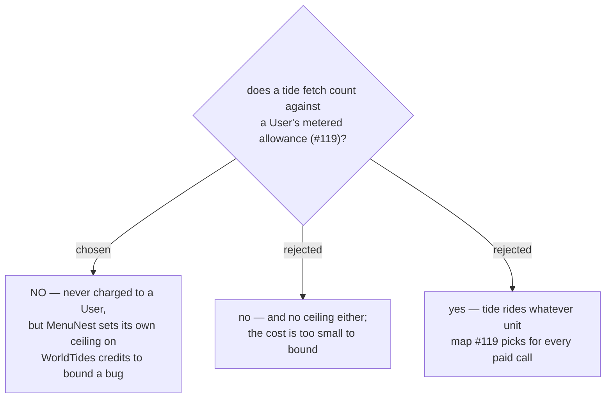

# Tide is not metered to the User, but it is capped server-side

Issue #135, decision map #138, ticket #143. Cross-map: #119 (per-**User** cost control).

Map #119's closed ticket #122 measured that **Places Text Search is 86% of a Trip's cost** at
$35/1,000 calls. Against that, tide under Design B (menunest-222) is noise:

| call | cost each | per **Trip** with five beach **Stop**s |
|---|---|---|
| Google Places Text Search | ~$0.035 | dominates |
| WorldTides `heights` + `extremes` | ~$0.0005 | **~$0.005 total** |

One Places search costs more than seven whole **Trip**s of tide data. **Capturing** a beach costs
seven times more in search than every **Tide reading** that beach will ever need.

## Why not metered (why option B lost)

Metering tide would be the tidy, one-rule answer, and it was genuinely on the table. It lost on two
counts. First, the code to count it and the words to explain it to a **User** both cost more than the
money they could recover. Second and decisively, **it would block this ticket on another map**: #119's
`metered-unit` (#121) and `metered-surfaces` (#126) are both still open, so #143 could not close until
work outside its own map did.

**A **Tide reading** therefore keeps working when a **User** is over their Places allowance.** That is
a deliberate asymmetry, and it should be recorded on #119 as a scope boundary: tide is explicitly
**not** a metered surface.

## Why a cap anyway (why option A lost)

Option A — no metering and no ceiling — treats "the unit cost is tiny" as if it bounded the total. It
does not. A retry loop, a runaway prefetch, or a **Trip** with an implausible number of **Beach**
**Stop**s multiplies a tiny number by an unbounded one, and the account is prepaid credits against a
real card. The ceiling exists to bound *that*, not to save the $0.005.

So MenuNest holds its own server-side ceiling on WorldTides credits. **The ceiling's value is
deliberately not fixed here** — it is a configuration figure that must be set before ship, not an
architectural decision, and setting it now would bake in a guess made with no production traffic to
size it against.

## What a **User** sees when the ceiling is hit

Nothing new is invented for this. menunest-031 already rules that a reading which cannot be obtained
is **rendered**, never hidden silently — that is what **No weather data** is, and its slashed-cloud
chip. A tide reading that cannot be fetched — ceiling reached, WorldTides down, or the station
missing — degrades the same way, to a visible "no tide data" chip in the slot the reading would have
occupied.

This follows the established precedent rather than choosing a new one. The alternative — hiding the
chip — would make a capped **Stop** indistinguishable from a **Place** that is not a **Beach**, which
is exactly the failure menunest-031 exists to prevent.

---

## Amendment — 2026-09-05, same day

**The "not metered" half of this ADR is wrong. The ceiling half stands.**

This ADR recorded that a tide fetch is *never* charged to a **User**. The **User** subsequently
corrected it: *"tide is free for some user but the app still need limit for prevent cost that come
from a bug"*.

**Tide is a metered surface after all.** It follows the same exemption model as every other paid call
— map #119's ticket #127 already states the requirement that *"some Users have no limit"*. So:

- A **User** who is **exempt** gets tide free, with no limit. That is what "free for some user" means.
- Every other **User** has tide counted like any other paid call, under whatever unit #119 settles.

The title of this ADR is therefore **half accurate** and is left unchanged deliberately, so that
citations to it still resolve; read it with this amendment.

### What survives unchanged

Everything about the **ceiling** stands, and the **User** explicitly reaffirmed it. It was never a
metering mechanism: it bounds a **bug**. A retry loop or runaway prefetch multiplies a tiny unit cost
by an unbounded number against prepaid credits on a real card, and per-**User** metering does not
protect against that — an exempt **User** has no limit at all, so for them the server-side ceiling is
the *only* bound that exists. Its value remains deliberately unset.

The degradation rule stands too: ceiling reached, or over a metered limit, renders a visible
"no tide data" chip per menunest-031, never a hidden one.

### What this costs

**#143 is no longer fully answerable on map #138.** The metering *mechanism* — what unit is counted,
which surfaces are metered, how exemption is expressed — belongs to three still-open tickets on map
#119: `metered-unit` (#121), `metered-surfaces` (#126) and `exemption-model` (#127). The decision-map
tooling cannot draw a blocking edge between two maps, so this dependency is recorded as a note rather
than wired.

This was foreseen: option B in the diagram above was rejected *because* it would block this ticket on
another map's work. The **User** chose C, then corrected to B's substance a few minutes later. The
rejection reason was right about the consequence; it was wrong to treat that consequence as
disqualifying.
