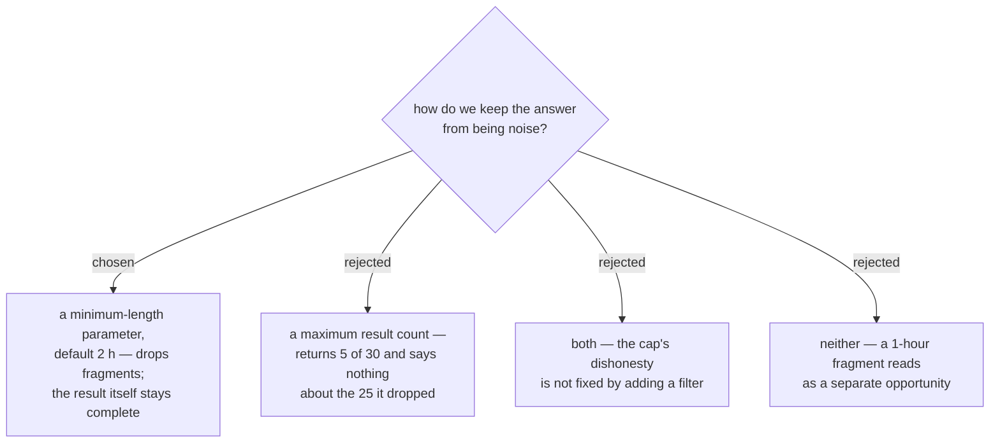

# A minimum Weather window length, not a result cap

Closes the length/volume question menunest-218 left open. Two problems, one fix.

**Fragmentation.** A single hour over threshold splits one good run in two. With a 60 % rain gate
and hours at 20/25/30/**62**/35/30, `06:00–12:00` becomes `06:00–09:00` *and* `10:00–12:00`. The
second is arithmetically true and practically noise: a **User** reads it as a second opportunity.
A minimum length removes it.

**Volume.** Over the full 10-day **Forecast horizon**, a place with a good morning and a good
evening yields roughly 20 **Weather window**s, more once fragments are counted.

A result cap was rejected because it lies by omission. Returning 5 of 30 with no marker lets the
assistant report "มี 5 ช่วงที่ดี" — false, with nothing anywhere to contradict it. menunest-218
rejected the day-level verdict on exactly this ground, and menunest-213 already records what a
silent null costs in an assistant's answer. Volume is better handled by the date range
menunest-222 added: "เสาร์อาทิตย์หน้า" searches two days, so a short answer comes from a narrower
question, not from a hidden truncation.

**Default 2 hours.** A 1-hour fragment does not survive; a real 2-hour morning window does. 3 h was
rejected as a default because a **Stop** on a **Trip** often occupies only 1–2 h, so 3 h would drop
answers the **User** would have used.

## Consequences

The parameter can be set to 1 to defeat the filter entirely, which is the escape hatch for a
**User** who genuinely wants every passing hour.

Fragmentation is *mitigated*, not solved: two 3-hour windows split by one bad hour both survive the
filter and still read as two opportunities. Bridging a single over-threshold hour inside an
otherwise-good run was considered and deliberately not taken — it would report an hour as inside a
**Weather window** when it failed its own **selected signal**, which contradicts the definition in
`CONTEXT.md`.
