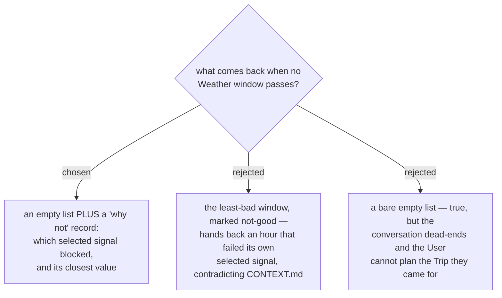

# An empty result names the blocking signal, and never hands back a failing window

A rainy-season "ปาย อาทิตย์หน้า วันไหนฝนไม่ตก" can legitimately match zero hours. A bare empty list
is honest and useless: the **User** came to plan a **Trip** and leaves with nothing to act on.

The **selected signal** rule already makes the fix cheap. The handler tests each signal on each
hour, so it already knows which one failed, how often, and by how much. Returning that turns the
dead end into the next turn:

> ไม่มีช่วงไหนผ่านเกณฑ์ — ฝนเกิน 60% ทุกชั่วโมง ต่ำสุดที่ 65%
> ถ้ารับฝน 70% ได้ มี 4 ช่วง จะดูไหม?

That is exactly the override menunest-219 made possible, and the "why not" record is what tells the
assistant *which number* to offer relaxing and *to what*. Without it, the assistant can only guess.

Handing back the least-bad window was rejected for the third time on the same ground: menunest-218
refused a day-level verdict that would call a rainy day good, menunest-224 refused a silent cap,
and this refuses a **Weather window** that failed its own **selected signal**. `CONTEXT.md` defines
a **Weather window** as a run where *every* selected signal stays inside its threshold — a
not-good window is not one, whatever flag it carries, and an assistant summarising a list rarely
preserves that flag.

## Consequences

The result is no longer a bare list. It becomes a small envelope: the **Weather window** list plus
a "why not" record. The record must be empty, and safely ignorable, whenever windows *are* found —
otherwise every successful call pays for the failure path.

The record needs to stay honest about **No weather data** too: zero windows because Google returned
nothing (ADR-030/031) is a different answer from zero windows because every hour was too wet, and
the two must not both surface as "ฝนตกทุกชั่วโมง".
