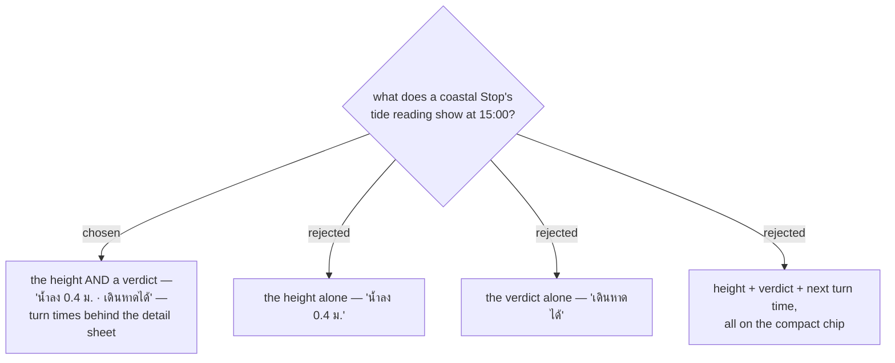

# A tide reading states the height and judges it

Issue #135, decision map #138, ticket #142.

The map's destination is that a **User** sees "whether the tide makes it worth visiting at their
arrival time". That wording is a **judgement**, not a reading — so option B was never enough on its
own. A **User** who is told `น้ำลง 0.4 ม.` still has to know what 0.4 m means at that particular
beach, which is exactly the work the feature exists to do for them.

But the verdict alone (option C) has no floor. The verdict is computed from one fixed rule for every
**Beach** (menunest-227), so it will sometimes be wrong for what the **User** actually planned — low
tide is good for walking out and bad for swimming, and the rule cannot know which. Keeping the height
on the chip means a wrong verdict costs the **User** nothing: the number is still there and they can
overrule it themselves. **The number is the fallback that makes a single fixed rule safe to ship.**

## The turn time is real, and it does not go on the chip

Option D — adding `ขึ้น 20:30` — answers the genuine next question, "how long have I got". It was
rejected on space, not on value. The compact **Stop** card already carries condition, rain
percentage, temperature, **Feels-like** and a **UV band** badge from the **Weather reading**; a sixth
element on a phone-width card is where that row stops being readable. The SPA has no component or
visual test harness, so nothing automated would catch it overflowing.

The turn times are therefore shown when the **User** taps through to the detail view. **No data is
lost by this**: menunest-228 makes the verdict relative to that station's own daily range, so the
day's high and low must be fetched to compute the verdict at all. They are already in hand — this is
a display split, not a second request.

Which surfaces render each half is ticket #144's decision, not this one. What is settled here is the
**split**: compact carries height + verdict, detail carries the turn times.
