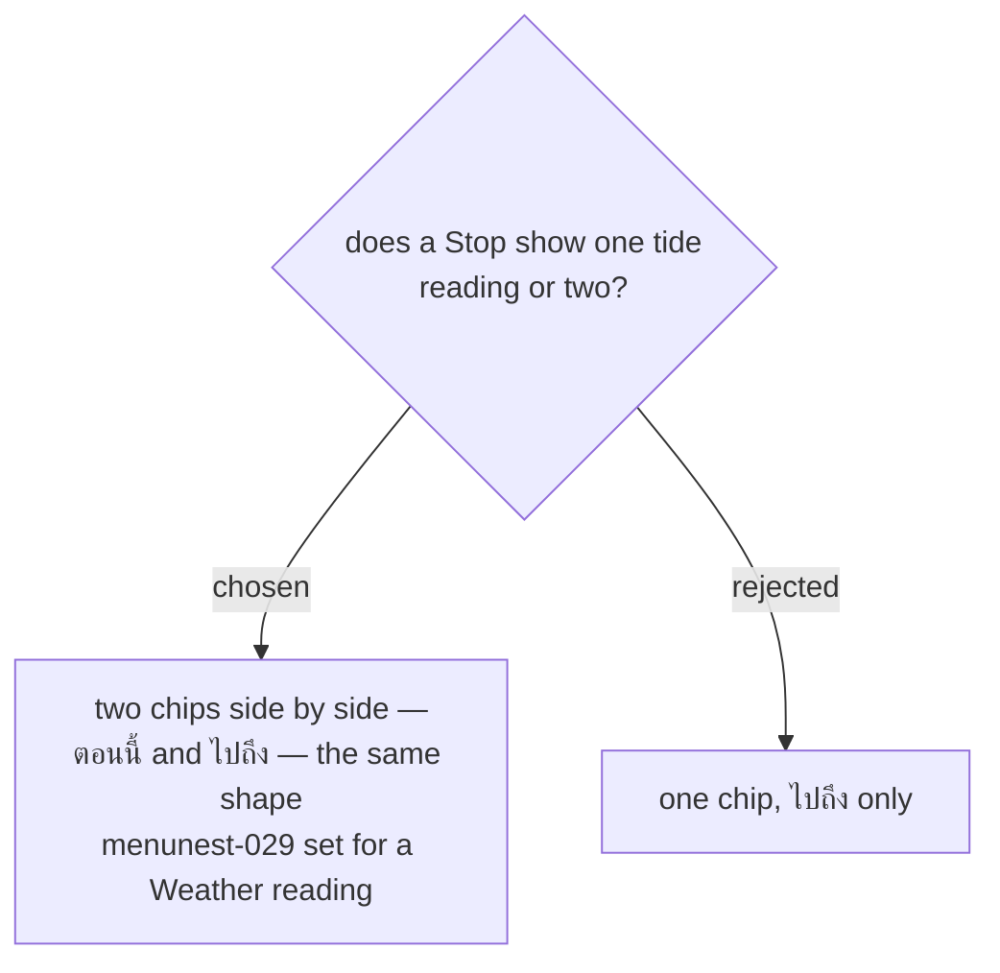

# A tide reading pairs Now and On-arrival, like a Weather reading

Issue #135, decision map #138, ticket #142.

menunest-029 established that a **Stop** carries two **Weather reading** chips side by side, **Now**
and **On-arrival**, and never a toggle between them. A tide reading adopts the same shape, so a
**User** learns one pattern for the whole card.

The case for one chip was real and is recorded here because it will be re-proposed. The map's
destination speaks only of the arrival time; the current tide at a beach being visited in five
months tells the **User** nothing; and one chip halves the data per station-day.

It lost on consistency. A card where weather shows two chips and tide shows one teaches the **User**
that the two are different kinds of thing, when they are both display-only per-**Stop** readings that
never feed the **Smart Schedule**. The data saving is also smaller than it looks: readings are cached
by `(station, date)` and served to every **User** from one cache (menunest-228), so the marginal cost
of the second chip is not per-**User**.

## Tide outlives the Forecast horizon, and that is a feature

A **Weather reading** resolves to **No weather data** beyond the **Forecast horizon** — ten days
(menunest-031). Tides are predictable years ahead, so on a **Trip** dated five months out the tide
chips carry real values while the weather chips are slashed-cloud placeholders.

This is the **opposite** of the usual availability story and must not be read as a bug. The tide
chip is often the only thing on a far-dated **Stop** card carrying information. It does mean the two
readings degrade on different horizons, so the tide reading must **not** reuse the weather chip's
horizon gate.
