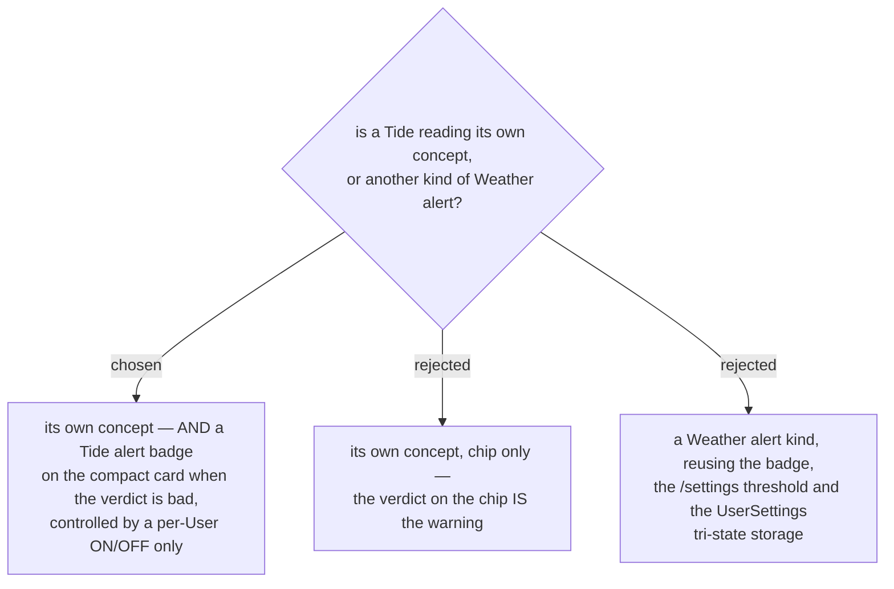

# A bad tide gets its own badge, but never a threshold

Issue #135, decision map #138, ticket #141.

A **Stop** card already carries two distinct things: a **Weather reading**, always shown, and a
**Weather alert**, shown only when the **On-arrival** reading crosses a **Weather-alert threshold**
the **User** set on `/settings`. This ticket asked which of the two a tide is.

The answer is **both shapes, but only one of the mechanisms**. A **Tide reading** stands beside a
**Weather reading** as its own concept, and a **Tide alert** badge fires when that reading's
**Tide verdict** is bad — the case the **User** actually cares about, arriving to find the beach under
water and no sand for a child to play on.

## Why there is no threshold (why option C fails)

A **Weather-alert threshold** works because its number is absolute. `UV ≥ 6` means the same thing in
ตราด and in ภูเก็ต, so the **User** types `6` once and it travels.

**A tide has no such number.** menunest-228 made "low" relative to each station's own daily range,
because the water is fully out at 0.4 m at หาดบานชื่น and at 1.2 m near Bangkok Bar. A stored
`เตือนเมื่อน้ำต่ำกว่า 0.5 ม.` would be correct at one station and wrong at most others — which is the
exact failure menunest-228 exists to prevent.

So the threshold machinery has **nothing coherent to store**. The **Tide alert** therefore takes a
per-**User** **on/off only**: a boolean on `UserSettings`, not the `null` / `0` / `N` tri-state
(menunest-091) that the UV and **Feels-like** thresholds use. Reusing that tri-state would invite a
future session to put a number in the `N` slot, and that number cannot be right.

## Why the chip alone was not enough (why option B lost)

Option B is the tidier answer and it was genuinely on the table: the verdict is already on the chip,
in the same place the badge would sit, so the badge says twice what the card says once.

It lost on **prominence, for the one case that matters**. The compact itinerary card is scanned, not
read — it already carries condition, rain percentage, temperature, **Feels-like**, a **UV band** badge
and now a tide height and verdict. A **User** planning a beach day for a child needs "there will be
no beach when you arrive" to survive that scan. That is what a badge is for, and it is why
**Weather alert** exists at all despite the **Weather reading** sitting next to it.

## What this does not change

The **Tide alert** is **display-only**, like everything else on this card: it never feeds the
**Smart Schedule**, an **arrival** time or a **Timing flag** (menunest-226, menunest-229). It is
**not** a safety warning — the map put rip currents and unsafe-swimming alarms out of scope, and a
badge saying the beach is submerged is a planning signal, not a hazard alarm.

Which surfaces render the badge remains ticket #144's decision. What is fixed here is that the badge
exists, that it is driven by the **Tide verdict** rather than by a number, and that its only control
is an on/off.
