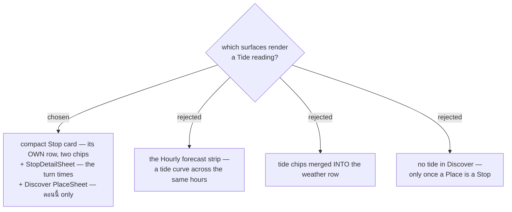

# Tide renders on three surfaces, not four

Issue #135, decision map #138, ticket #144. Confirmed against a rendered mockup, not against prose:
`docs/mocks/tide-reading-mock.html` (published as an Artifact for review). The mockup is drawn in the
real `trips-tokens.css` palette, so what was approved is what the build inherits.

## The three surfaces

**Compact Stop card — its own row.** The **Tide reading**'s two chips sit on a row *beneath* the
**Weather reading**'s two, not merged with them (option C rejected). Four chips on one row wrap badly
at phone width, and the stacked pairing reads as two related-but-separate facts, which is what they
are. A **Place** that is not a **Beach** shows **no tide row at all** — that absence is what makes the
"ไม่มีข้อมูลน้ำ" state legible rather than looking like a bug.

**StopDetailSheet — the turn times.** menunest-226 kept them off the chip; this is where they land,
with the day's high and low and the arrival marked among them. The data is already in hand: the
relative rule (menunest-228) needs that day's extremes to compute the verdict at all. The WorldTides
attribution string (menunest-231) renders here.

**Discover PlaceSheet — `ตอนนี้` only.** A **Place** in **Discover** sits on no **Day**, so it has no
**arrival** time and an **On-arrival** reading cannot exist for it. One `ตอนนี้` chip answers the
question **Discover** is actually for — is it worth going now.

## Why not the Hourly forecast strip (option B)

A tide curve across the same hours the **Hourly forecast** already draws would fit conceptually, and
the data supports it. It was rejected on density: that strip already carries **Feels-like**,
temperature, condition, rain percentage, **UV index** and `isDaytime` per hour, and it is the surface
**Weather-based retiming** operates on. Adding a second series doubles the work for a view that is
already the busiest in the app. This is a *not yet*, not a *never* — the cost is the strip's
complexity, and that cost falls if it is ever redesigned.

## The one cost this adds

**Discover** is the only tide surface where call volume can grow with browsing rather than with
planning: it can list many **Place**s, and each **Beach** a **User** opens is one WorldTides call
under Design B (menunest-231), which is per-**User** and cannot be shared. Every other surface is
bounded by the **Stop**s on one **Day**.

This does not change menunest-232's answer — tide is metered under #119's exemption model, and
MenuNest's own credit ceiling still bounds a bug — but **Discover is where that ceiling is most likely
to be approached first**, and whoever implements it should not treat browsing volume as equivalent to
itinerary volume.

## What the mockup settled that prose had not

Two things only became visible once drawn:

- **`ตอนนี้` is the weakest element on a future-dated Stop.** menunest-229 chose two chips for
  symmetry with the **Weather reading**, and that still stands — but on a **Trip** five months out the
  current tide is real and meaningless. Recorded here because it is the first thing to reconsider if
  the card ever needs to lose an element.
- **The non-**Beach** card matters as much as the **Beach** ones.** Seeing a **Stop** with no tide row
  beside one showing "ไม่มีข้อมูลน้ำ" is what proves the two states are distinguishable. That
  distinction is menunest-031's whole purpose and it is invisible in a written spec.
