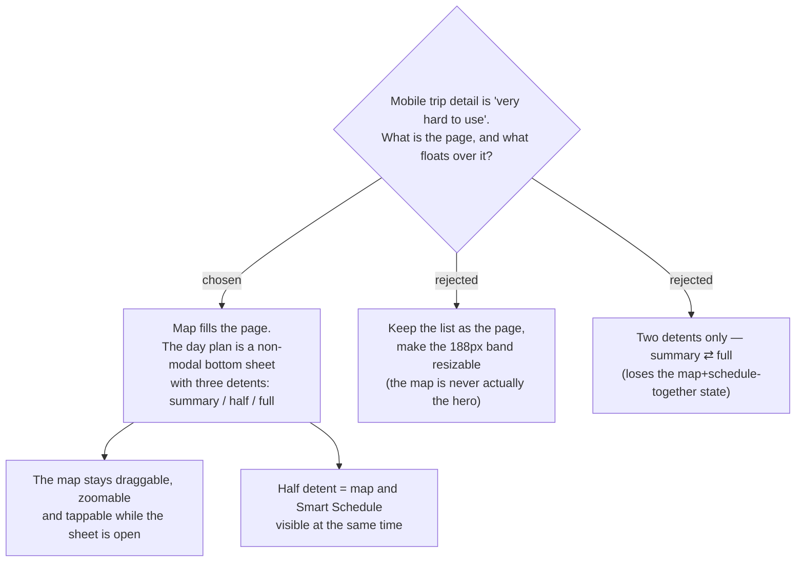

# menunest-234: The mobile trip screen is a map with a three-detent plan sheet over it

**Date:** 2026-09-20
**Status:** Accepted
**Relates to:** ADR-010 (Map-Forward — the map is the hero), ADR-026 (the 188px collapsible map band it replaces), issue #6
**Mock:** Claude Design → *MenuNest design system* → Screens → `trip-detail-mobile` (confirmed with the owner)

## Context

The owner reported the trip surfaces as "ใช้งานยากมาก" on both phone and web and named
four concrete pains, all four of which trace to the same root: **the map is furniture,
not the surface.** On mobile, ADR-026's map band is either 188px (too small to read a
route) or `position: fixed; inset: 0` full-screen (`TripDetailPage.css:582`), which
occludes the plan entirely — there is no state in which the route and the Smart Schedule
are legible together. ADR-010 makes the map the hero; the implementation made it a strip.

Reviewed against the pattern the category has converged on — Google Maps' non-modal,
multi-detent bottom sheet, Material 3's expanding bottom sheet, and Wanderlog's
map-plus-list planning surface.

## Decision

On mobile/tablet the **Itinerary** *is* the map: `TripMap` fills the viewport, and the
day's plan lives on a **non-modal bottom sheet with three detents**:

| detent | shows | map gets |
|---|---|---|
| **summary** (opening state) | drag handle, day label, visited badge, start–end, total travel, นำทาง | ~80% of the screen |
| **half** | the above + the scheduled **Stop** list with **Legs**, flags and weather chips | ~45% |
| **full** | the above + จัดลำดับ, + เพิ่มจุดแวะ, the มาแล้ว drawer | a visible strip, so the map is never "gone" |

The sheet is **non-modal**: the map keeps every gesture — pan, zoom, tap — while the
sheet is open, and no scrim is drawn. The trip's name, date and edit control move to a
**floating top bar** over the map, and the **Day** switcher becomes floating chips.

Rejected: keeping the list as the page with a resizable band (cheap, but the map
stays a passive strip — it does not answer the complaint); a two-detent sheet
(summary ⇄ full loses the half state, which is the one that shows the route and the
schedule together).

## Consequences

**Positive:** Every one of the four reported pains is addressed by the same move; the
map+schedule state that ADR-026 could not produce becomes the middle detent.

**Negative:** `ItineraryTab` is restructured rather than tweaked — its list becomes the
sheet's content. ADR-026's collapsible band and its `itineraryMapExpanded` state bit are
superseded. A drag-to-detent sheet is a real interaction to build (drag vs. scroll
hand-off inside the sheet), and the repo has **no component/visual test harness**, so it
must be verified interactively and by an e2e spec.
