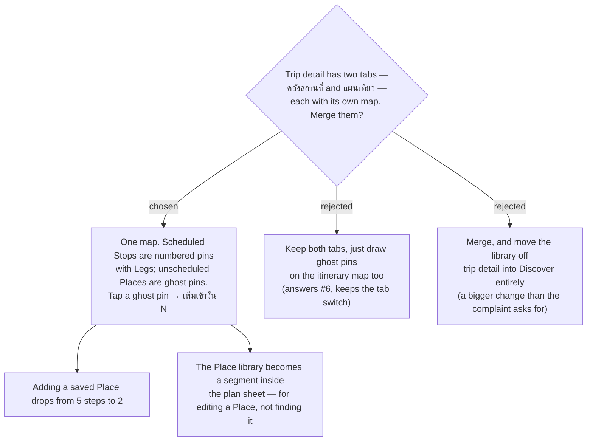

# menunest-235: The trip screen has one map, and library Places are ghost pins on it

**Date:** 2026-09-20
**Status:** Accepted
**Relates to:** menunest-234 (the plan sheet the merged surface lives in), ADR-016 (map-centric add-place), ADR-158 (adding an existing Place is not a Capture), issue #6
**Mock:** Claude Design → *MenuNest design system* → Screens → `trip-detail-mobile`

## Context

Trip detail carries two top-level tabs, each rendering its own `TripMap`
(`TripDetailPage.tsx`): **คลังสถานที่**, the Trip's saved **Places**, and **แผนเที่ยว**,
the day's **Smart Schedule**. Scheduling a Place the User already saved therefore costs
five steps — switch tab, read the list, remember the name, switch back, `+ เพิ่มจุดแวะ`,
find it again in `เลือกจุดแวะ` — and at no point are the saved Places and the day's route
visible on the same map, so the one question that actually decides the answer ("is this
place on the way?") cannot be asked. Issue #6 has asked for exactly this since July.

## Decision

Trip detail has **one map**. The active **Day**'s scheduled **Stops** render as today —
numbered pins joined by **Leg** polylines. Every other **Place** on the Trip renders on the
same map as a **ghost pin**: smaller, desaturated, unnumbered, behind the route in z-order.
Tapping a ghost pin offers **เพิ่มเข้าวัน N**, which schedules it on the active Day — the
existing one-tap path of ADR-158, not a **Capture**.

The two top-level tabs are removed from the trip screen. The Place **library** survives as a
**segment inside the plan sheet** (`แผนวัน` / `คลัง`), whose job is *editing* a Place —
category, season, checklist, review links — not finding one to schedule, because the map now
does that.

Rejected: keeping both tabs and only adding ghost pins (answers #6 but leaves the tab
switch, which is the reported pain); moving the library out to **Discover** entirely (a
larger change than the complaint warrants, and the per-Trip editors would have no home).

## Consequences

**Positive:** Closes #6. Scheduling a saved Place is two taps. "Is this on the way?" becomes
answerable by looking.

**Negative:** The map now draws two pin classes at once and can get crowded on a Trip with
many saved Places — the ghost layer needs a visibility rule (and possibly a toggle) rather
than being drawn unconditionally. `tripsSlice.activeTab` / `placesView` and the
`SegmentedTabs` they drive are superseded on this screen.
