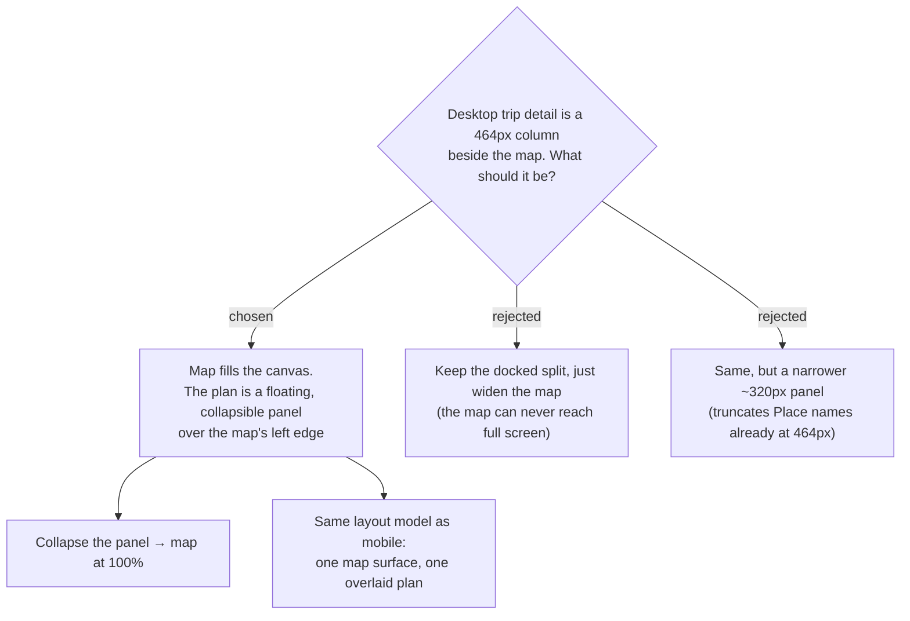

# menunest-236: Desktop trip detail is a full-bleed map with a collapsible floating plan panel

**Date:** 2026-09-20
**Status:** Accepted
**Relates to:** menunest-234 (the mobile sheet this mirrors), menunest-235 (one map), ADR-010 (Map-Forward)
**Mock:** Claude Design → *MenuNest design system* → Screens → `trip-detail-desktop`, option A (confirmed with the owner)

## Context

Desktop trip detail is `grid-template-columns: 464px 1fr` (`TripDetailPage.css:77`): the map
is a *pane*, permanently capped at the leftover width, and can never be shown at full size.
Having chosen a map-as-page spine for mobile (menunest-234), keeping a docked split on
desktop would mean two different layout models for the same screen — and would leave the
same complaint unanswered on the wider breakpoint.

## Decision

On desktop the map fills the whole content canvas. The day plan lives in a **floating panel**
(~376px) inset over the map's left edge, rounded and shadowed, and **collapsible to a thin
rail** — collapsed, the map is 100% of the canvas. The panel holds, top to bottom: the Trip
header (name, date, `IsDaily`, edit), the **Day** chips, the `แผนวัน` / `คลัง` segment, the
day summary row with นำทาง, and the Stop list.

Two pieces move **onto the map**, where a map-driven screen expects them: the day roll-up
badge (จุด / กม / ชม) at the top-right, and the zoom / locate-me controls at the bottom-right.

Rejected: widening the docked split (cheap, but the map is still a pane — it can never be the
whole screen, which is the point of Map-Forward); a ~320px panel (Place names already
truncate at 464px).

## Consequences

**Positive:** One layout model across breakpoints — the panel and the mobile sheet are the
same component with a different container, so the Stop list, summary and segment are written
once. The map reaches full-screen with one click.

**Negative:** The panel permanently covers the left ~38% of the map, so `fitBounds` must
account for the panel (and, on mobile, for the sheet) via padding, or pins will be framed
underneath it. The dark `.trip-topbar` is superseded by the panel header.
