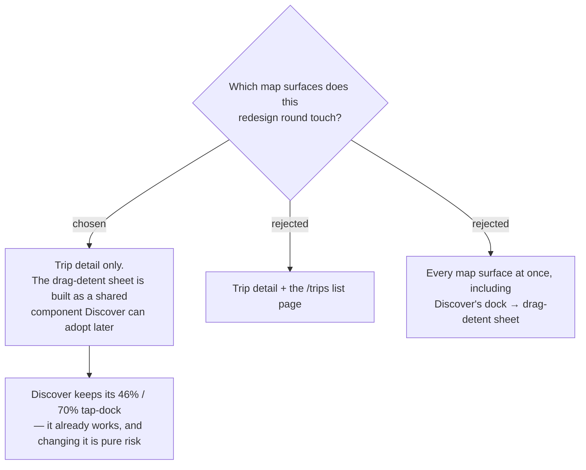

# menunest-237: The redesign stops at trip detail; Discover keeps its dock for now

**Date:** 2026-09-20
**Status:** Accepted
**Relates to:** menunest-234, menunest-236, ADR-097 (Discover is a map-forward event-driven screen)

## Context

`/discover` already runs the layout this redesign is adopting — full-screen map, floating
top bar, FABs, a bottom dock (`DiscoverPage.tsx`, `DiscoverPage.css:123-133`). Its dock,
however, is two fixed heights toggled by state (`list` 46%, `detail` 70%), not a dragged
sheet. Converting it as part of this round would mean rewriting a surface nobody complained
about, on the same push that rewrites trip detail — and **pushing to `main` deploys to prod**.

## Decision

This round changes **trip detail only**. The drag-detent sheet is written as a **shared
component** (not inside `ItineraryTab`), so Discover can adopt it in a later, separate round
without a second implementation existing. Discover's dock is left exactly as it is, and the
`/trips` list page is out of scope.

## Consequences

**Positive:** One screen changes per deploy, so a visual regression is attributable. The
shared-component shape keeps the two surfaces from diverging permanently.

**Negative:** Until Discover adopts it, two bottom-sheet behaviours coexist — dragged on trip
detail, tapped on Discover. That inconsistency is accepted deliberately and is the follow-up
this ADR predicts.
