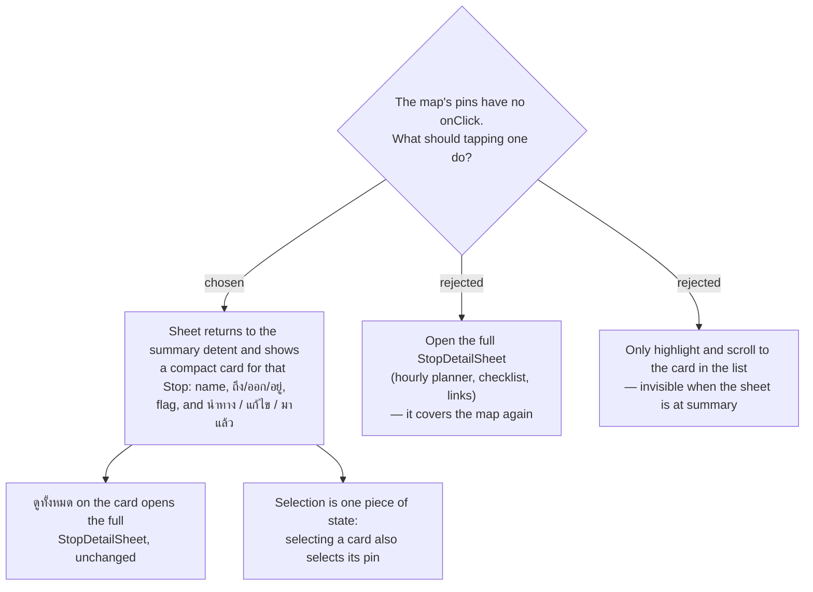

# menunest-238: A pin and its Stop card are one selection, and a tapped pin opens a compact card

**Date:** 2026-09-20
**Status:** Accepted
**Relates to:** menunest-234 (the sheet the card appears in), menunest-235 (one map), ADR-022 (pins reflect flag severity)
**Mock:** Claude Design → *MenuNest design system* → Screens → `trip-detail-mobile`, frame 4

## Context

`TripMap` renders route pins with no `onClick` at all (`TripMap.tsx:216-224`) — the map
cannot be used to *do* anything, which the owner named as the single worst pain. The
existing `StopDetailSheet` is the opposite extreme: times, both **Weather readings**, the
**Hourly forecast** with **Weather-based retiming**, checklist, review links, season. Opening
it from a pin would re-occlude the map the redesign just freed.

## Decision

A **Stop is selected**, not "a pin is tapped" or "a card is tapped" — one piece of state,
driven from either surface:

- **Tap a pin** → the pin enlarges, the sheet drops to the **summary** detent and shows a
  **compact Stop card**: ordinal + name, ถึง / ออก / อยู่, the **Timing flag** if any, the
  **Weather reading**, and three actions — **นำทาง**, **แก้ไข**, **มาแล้ว** — plus **ดูทั้งหมด**.
- **ดูทั้งหมด** opens the existing `StopDetailSheet` unchanged. Nothing is removed from it.
- **Tap a Stop card in the list** → the same selection: the map pans to that pin and enlarges
  it. The list does not need to be reachable for the map to be useful, and vice versa.
- Deselect: the ✕ on the card, a tap on empty map, or dragging the sheet back up to the list.

Rejected: opening the full `StopDetailSheet` from a pin (covers the map — the problem being
fixed); highlight-and-scroll only (on mobile the list is not visible at the summary detent,
so the tap would appear to do nothing).

## Consequences

**Positive:** The map becomes an input surface with one small new component, and the three
actions a selected Stop actually needs are one tap from the map.

**Negative:** A third Stop surface now exists (compact card, full sheet, list card) and the
three must not drift — the compact card should read its fields from the same schedule
projection the list card uses, not its own.
