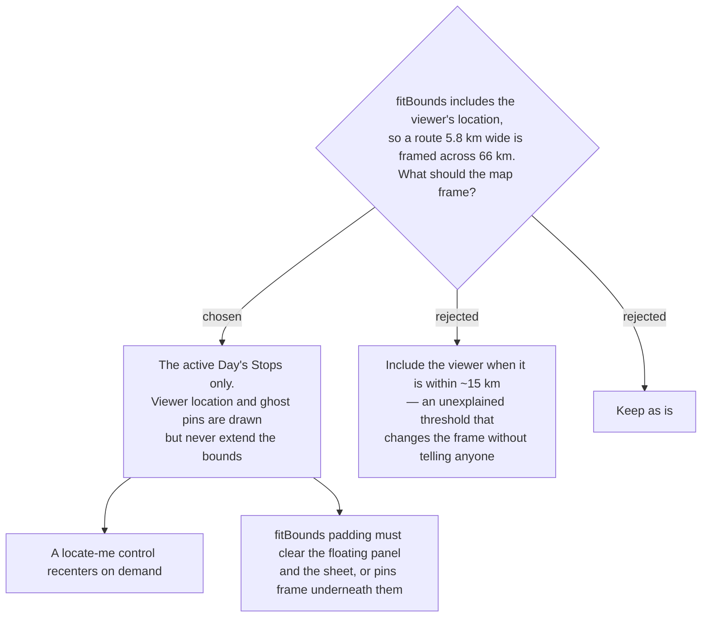

# menunest-239: The map frames the active Day's Stops and nothing else

**Date:** 2026-09-20
**Status:** Accepted
**Relates to:** ADR-027 (the Approach leg), menunest-235 (ghost pins), menunest-236 (the floating panel that overlaps the map)

## Context

`useDayRoute` pushes `viewerLocation` in as the route's first point (`useDayRoute.ts:122`)
and `TripMap` feeds that whole path to `fitBounds` (`TripMap.tsx:139-141`). Opening a Pattaya
day from Rayong therefore frames ~66 km to show two Stops 5.8 km apart — they collapse into
a corner. The **Approach leg** itself is correct and stays (ADR-027); only the *framing* is
wrong. menunest-235 adds ghost pins, which would make this worse if they counted too.

## Decision

`fitBounds` is computed from the **active Day's scheduled Stop coordinates only**. The
viewer's location marker and the **Approach leg** polyline still render, and may fall outside
the viewport; a **locate-me** control recenters on demand. **Ghost pins** (unscheduled
Places) render but never extend the bounds.

Because the plan panel (desktop) and the sheet (mobile) sit **over** the map, `fitBounds`
padding must reserve their area — otherwise pins are framed underneath them and the fix is
only half done.

Rejected: a distance threshold for including the viewer (the frame would change on a rule the
User cannot see); keeping the current behaviour.

## Consequences

**Positive:** The day's route fills the map at every zoom-to-fit, which is the whole point of
a route map. One edit fixes the most visible symptom the owner reported.

**Negative:** A User far from their trip no longer sees themselves on open, and must press
locate-me. Padding now depends on layout state (panel collapsed/expanded, sheet detent), so
`fitBounds` must re-run when that state changes — the same resize concern ADR-026 called out.
