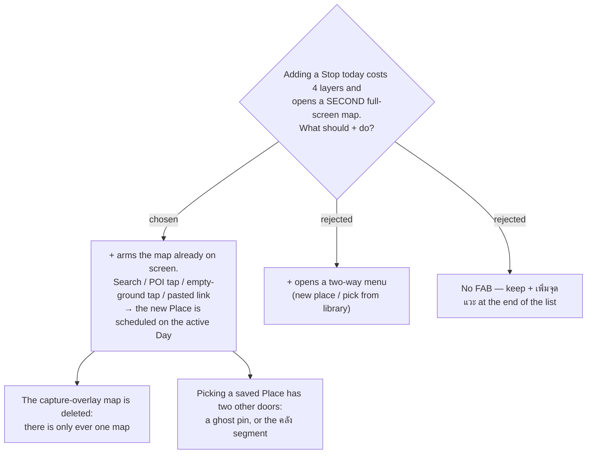

# menunest-240: The add control arms the one map instead of opening a second one

**Date:** 2026-09-20
**Status:** Accepted
**Relates to:** ADR-163 (capture is one surface-agnostic component; both maps accept every input), ADR-164 (empty-ground tap is a coordinate capture), ADR-067/068 (itinerary capture is single-shot and schedules the Stop), menunest-235 (one map)

## Context

From the itinerary, adding a Stop runs `+ เพิ่มจุดแวะ` → `เลือกจุดแวะ` → `เพิ่มสถานที่ใหม่` →
a **second** `TripMap` mounted full-screen in `.capture-overlay` (`TripDetailPage.tsx`). Once
trip detail has exactly one map (menunest-235), that overlay is a duplicate of the map already
on screen — and it is the main reason the "add" path feels four layers deep.

## Decision

The **+** control **arms the map that is already on screen** — the existing **Capture mode**
of ADR-163, on the surface the User is looking at. Every input ADR-163/164 already supports
keeps working: search, a tap on a Google POI, a tap on empty ground (coordinate capture), a
pasted Maps link. On save the new **Place** is added as a **Stop** on the **active Day**, the
single-shot behaviour of ADR-067/068, and the map disarms.

The `.capture-overlay` second map is removed. Scheduling a **saved** Place keeps the two doors
menunest-235 gave it — its ghost pin, or the `คลัง` segment — so **+** does not need a menu.

Rejected: a two-way menu on **+** (one extra tap on every capture, to reach a list that two
other controls already reach); keeping the in-list button only (on mobile the list is not
visible at the summary detent, so adding would first require dragging the sheet up).

## Amendment (same day, found while writing the spec)

Merging the two **+** controls would otherwise lose a path the Places tab had: saving a
**Place** to the Trip **without** scheduling it. So the **Capture** preview offers **two**
actions — **เพิ่มเข้าวัน N** (primary, the ADR-067/068 single-shot behaviour above) and
**เก็บเข้าคลัง** (secondary, which saves the Place and leaves it as a **ghost pin**). Without
the second action there would be no way to create a ghost pin, and menunest-235 would have
nothing to show.

## Consequences

**Positive:** Add drops from four layers to one armed tap, and the app never shows two maps.

**Negative:** While armed, every map tap belongs to capture (ADR-163's rule) — on a surface
that is now also the *browsing* surface, the armed state must be unmistakable (banner +
explicit exit), or a User will tap a pin expecting selection and get a capture preview. The
`addStopForDayId` / `addMode` slice state can be simplified to one armed flag, but that is a
cleanup this ADR permits rather than requires.
