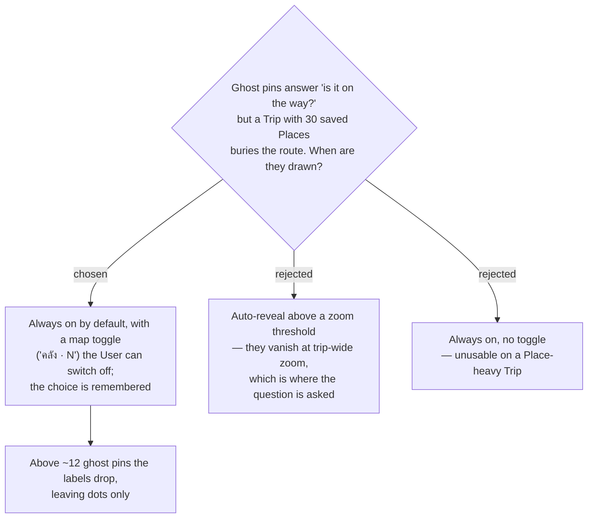

# menunest-241: Ghost pins are always drawn, behind a map toggle the User controls

**Date:** 2026-09-20
**Status:** Accepted
**Relates to:** menunest-235 (ghost pins), menunest-239 (ghost pins never extend the bounds), issue #6

## Context

menunest-235 puts every unscheduled **Place** on the same map as the route. That is the whole
point — but it is also unbounded: a Trip carries as many Places as the User saved, and a
planning map that hides its own route under a field of dots has traded one unusable screen
for another.

## Decision

Ghost pins are **drawn by default** and controlled by a **map toggle** labelled with the
count (`คลัง · 5`), sitting with the other map controls. The setting is **remembered** —
per User, not per Trip, since it expresses a working preference, not a property of the trip.
Above roughly **12** visible ghost pins the labels are dropped and only the dots render, so
density degrades the annotation rather than the map.

Rejected: revealing them above a zoom threshold (at trip-wide zoom — exactly where "is this
on the way?" is asked — they would be invisible); always-on with no escape.

## Consequences

**Positive:** The default teaches the feature, and the Trip that needs the escape hatch has
one that takes a single tap.

**Negative:** One more persisted UI preference, and a label-density rule that has no automated
test in this repo (no component/visual harness) — it must be checked interactively on a
Place-heavy Trip.
