# MenuNest — Architecture & Flows

End-to-end view of MenuNest's two products under one repo:

- **Meal Planning** — recipes, stock, meal plan, shopping list, AI assistant, budget (family-scoped, multi-user).
- **Health** — migraine / symptom tracker with medication intake, follow-up push notifications, doctor-report share links, drug photo uploads (user-scoped, single-user).

Each section below is a **GitHub-flavored Mermaid sequence diagram** of one real flow, traced against the actual handlers in `backend/src/MenuNest.Application/UseCases/**` and the matching React pages in `frontend/src/pages/**`. References point at the canonical handler/component so you can read the diagram next to the code.

> Mermaid renders natively in GitHub markdown — no plugins needed.

---

## Table of contents

1. [System context](#1-system-context)
2. [Authentication & user provisioning](#2-authentication--user-provisioning) — MSAL / Google → JWT → `UserProvisioner`
3. [Family — join via invite code](#3-family--join-via-invite-code)
4. [Recipe — create with photo upload](#4-recipe--create-with-photo-upload) (Blob SAS)
5. [Meal plan — cook batch & stock deduction](#5-meal-plan--cook-batch--stock-deduction)
6. [Shopping list — mark bought → auto-restock](#6-shopping-list--mark-bought--auto-restock)
7. [AI assistant — Gemini tool-loop with confirm-before-write](#7-ai-assistant--gemini-tool-loop-with-confirm-before-write)
8. [Health — quick-log attack (start episode)](#8-health--quick-log-attack-start-episode)
9. [Health — take medication & schedule follow-up](#9-health--take-medication--schedule-follow-up)
10. [Health — follow-up push (0-tap response)](#10-health--follow-up-push-0-tap-response)
11. [Health — drug photo upload (SAS, multi-photo)](#11-health--drug-photo-upload-sas-multi-photo)
12. [Health — doctor report share link (QR + HMAC)](#12-health--doctor-report-share-link-qr--hmac)

---

## 1. System context

The app is two SPAs against one ASP.NET Core API, with Azure-managed services for data and identity. The frontend is delivered by Static Web Apps; the API runs on App Service Linux.

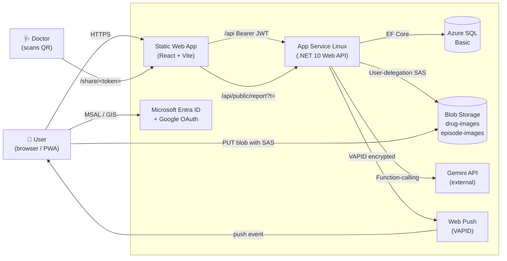

**Trust boundaries**

| Boundary | Who authenticates | How |
|---|---|---|
| SPA → API | The signed-in user | `Authorization: Bearer <JWT>` validated by `Microsoft.Identity.Web` |
| Doctor → API | Nobody (anonymous) | Only `/api/public/report?t=<token>` — HMAC-signed token + DB hash lookup |
| Browser → Blob | The signed-in user, **once** | Short-lived (15 min) user-delegation SAS scoped to one blob path |
| API → Gemini | The API service | Server-side API key (`Gemini__ApiKey` config) |

---

## 2. Authentication & user provisioning

Users sign in with **either** Microsoft (MSAL.js, Entra ID multi-tenant + personal accounts) or **Google** (GIS). Both produce a JWT that the API validates. On the **first** authenticated request, [`UserProvisioner.GetOrProvisionCurrentAsync`](../backend/src/MenuNest.Infrastructure/Authentication/UserProvisioner.cs) lazily creates the `User` row from the token's claims. There is no separate "register" call.

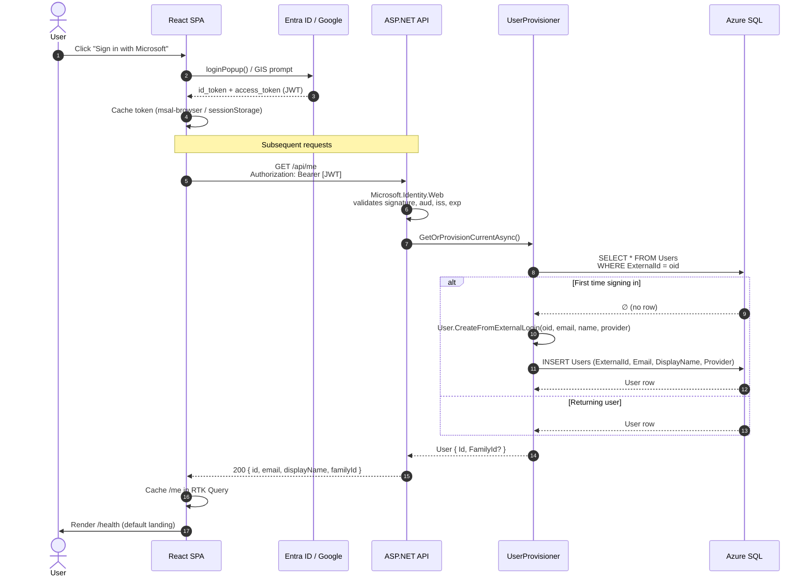

**Key decisions**

- `ExternalId` = the IdP's stable subject (Entra `oid` claim or Google `sub`). It's `UNIQUE` and the only join key.
- `FamilyId` is nullable. `RequireFamilyAsync` throws `DomainException` → HTTP 400 if the caller hits a family-only endpoint without joining a family. Health endpoints use `GetOrProvisionCurrentAsync` instead (no family required).
- The SPA's `ProtectedRoute` gate ([`frontend/src/shared/components/ProtectedRoute.tsx`](../frontend/src/shared/components/ProtectedRoute.tsx)) waits for MSAL's `inProgress === None` before deciding — otherwise the first render flashes false and bounces signed-in users to `/login`.

---

## 3. Family — join via invite code

A `Family` has a 6-character invite code. Anyone with the code can join via the `/join-family` page until the owner rotates it. One user belongs to at most one family.

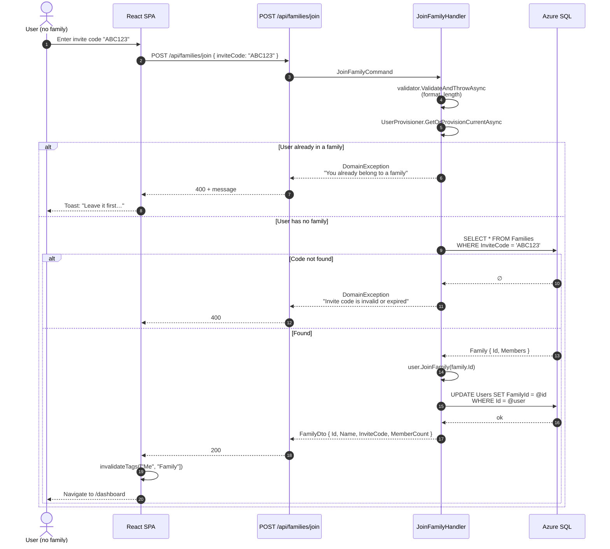

Source: [`JoinFamilyHandler`](../backend/src/MenuNest.Application/UseCases/Families/JoinFamily/JoinFamilyHandler.cs), [`InviteCode`](../backend/src/MenuNest.Domain/ValueObjects/InviteCode.cs) value object.

---

## 4. Recipe — create with photo upload

Photos go **direct browser → Blob** using a short-lived user-delegation SAS. The API never proxies the bytes — it only mints the SAS and stores the resulting blob path on the `Recipe` row. Same shape as the [Health drug-photo flow](#11-health--drug-photo-upload-sas-multi-photo) below; the recipe flow is single-photo.

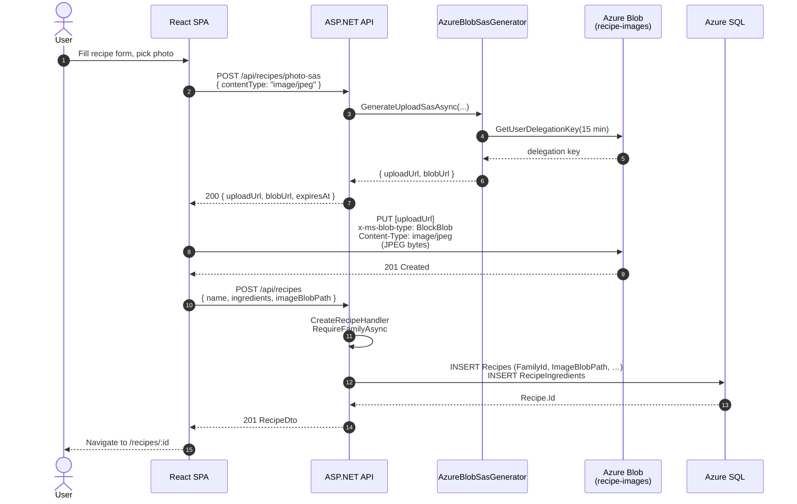

The browser is the **only** path the photo bytes ever travel. `Storage.allowSharedKeyAccess` is `false` on the storage account — user-delegation SAS (an Entra-issued key, not the account key) is the only mint mechanism, so a compromised app config can't forge a SAS without a valid Entra principal.

---

## 5. Meal plan — cook batch & stock deduction

"Cook" turns one or more `Planned` meal plan entries into `Cooked` and **deducts ingredients from family stock**. If stock is short, deduction clamps at zero, the missing ingredient is recorded in `CookNotes`, and the user gets a warning instead of an error — the meal still cooks.

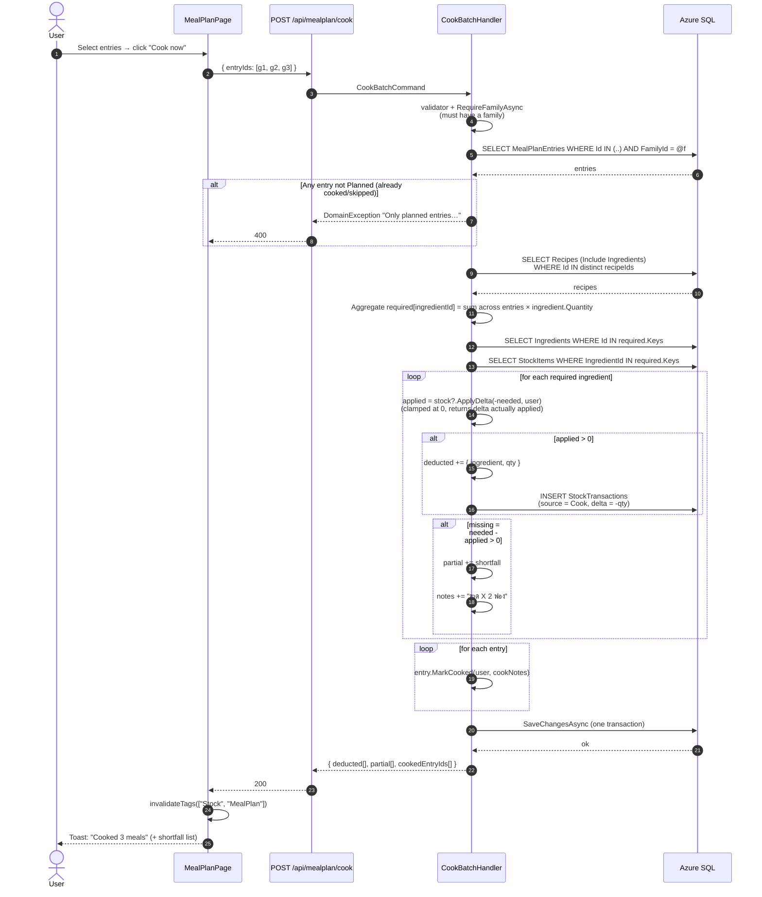

Source: [`CookBatchHandler`](../backend/src/MenuNest.Application/UseCases/MealPlan/CookBatch/CookBatchHandler.cs). The `StockTransaction` audit row uses the **first** entry's id as `SourceRefId` for a batch cook — there's no canonical single source row, but the audit trail still ties back to a real meal plan entry.

---

## 6. Shopping list — mark bought → auto-restock

Marking a shopping list item as **bought** auto-increments the family stock by that item's quantity and records a `StockTransaction` with `Source = ShoppingListBought`. Stock is created lazily — buying an ingredient the family has never tracked just creates a fresh `StockItem` row.

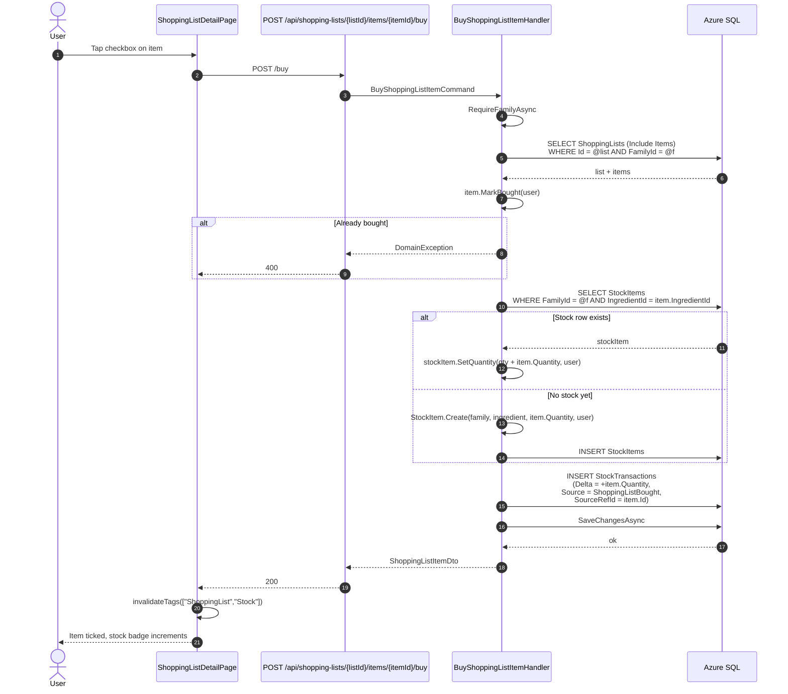

Source: [`BuyShoppingListItemHandler`](../backend/src/MenuNest.Application/UseCases/ShoppingList/BuyShoppingListItem/BuyShoppingListItemHandler.cs). The mirror operation `unbuy` reverses both effects.

---

## 7. AI assistant — Gemini tool-loop with confirm-before-write

The assistant uses **function calling** against Gemini. Read tools (`SearchRecipes`, `CheckStock`, `GetMealPlan`, `GetShoppingLists`, `GetFamilyInfo`) execute immediately. **Write tools** (`CreateRecipe`, `AddToMealPlan`, `CreateShoppingList`, `AddShoppingItems`) are **deferred** — the assistant proposes them, persists the tool-call JSON on its message, and waits for the user to type a Thai/English confirmation phrase (`ตกลง`, `confirm`, `ok`, …) on the next turn before executing.

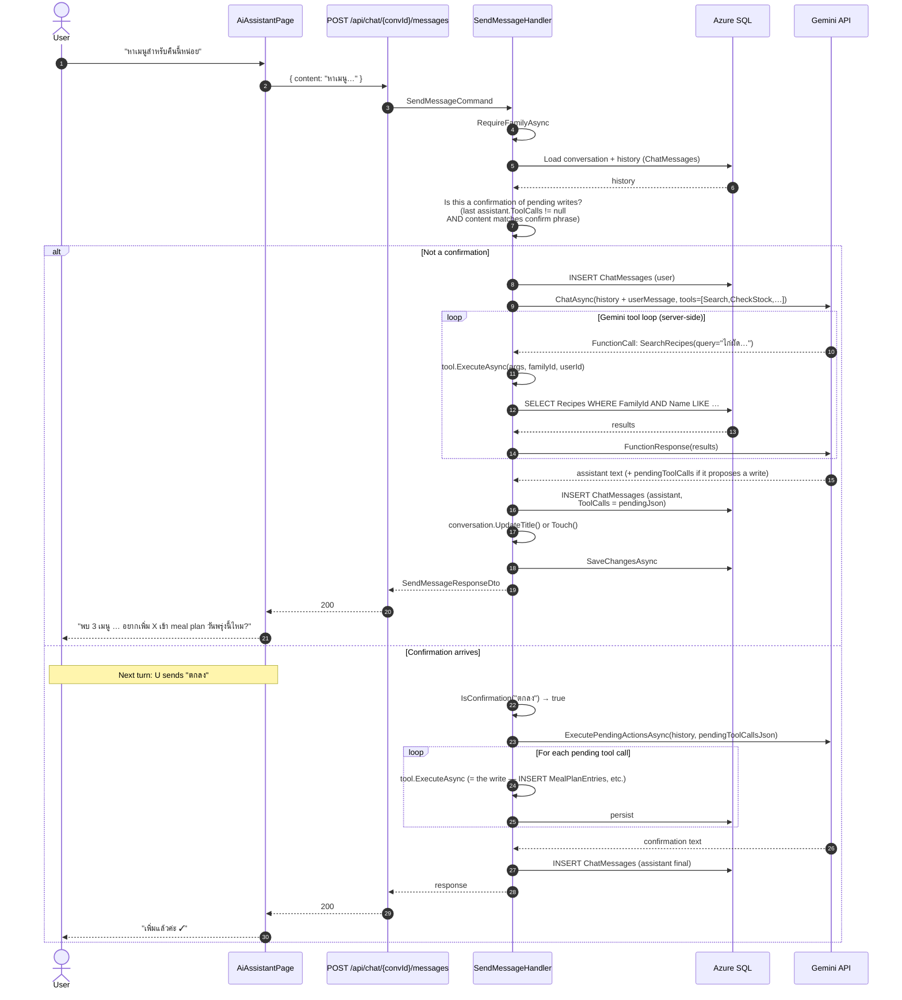

Source: [`SendMessageHandler`](../backend/src/MenuNest.Application/UseCases/Chat/SendMessage/SendMessageHandler.cs), [`GeminiChatService`](../backend/src/MenuNest.Infrastructure/AI/GeminiChatService.cs), tools in [`backend/src/MenuNest.Infrastructure/AI/Tools/`](../backend/src/MenuNest.Infrastructure/AI/Tools/).

`AutoCallFunction = false` is set on the Gemini model — the **API** drives the tool loop, not the SDK. This lets us audit each tool invocation, return Thai-localized errors, and inject the confirm-gate.

---

## 8. Health — quick-log attack (start episode)

`/health` is the default landing page. Tapping a symptom + severity creates a `SymptomEpisode`, optionally with migraine-specific attributes (aura, location, quality, associated symptoms, functional impact, triggers).

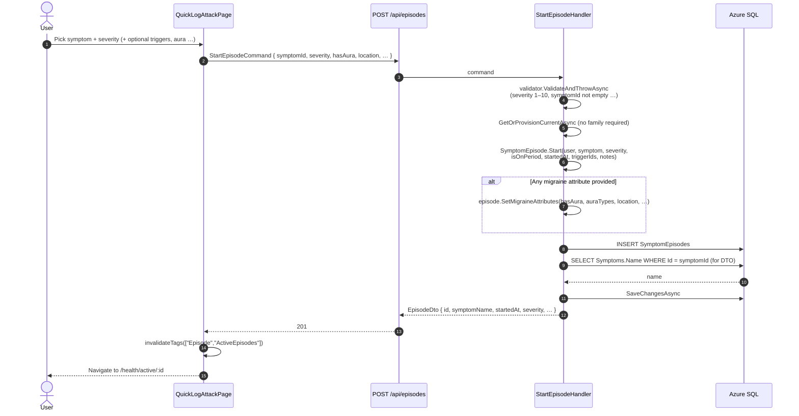

Source: [`StartEpisodeHandler`](../backend/src/MenuNest.Application/UseCases/Health/Episodes/StartEpisode/StartEpisodeHandler.cs). The domain method `SetMigraineAttributes` overwrites the whole migraine block — the handler skips the call if no attribute was provided so future-default values aren't clobbered with nulls.

---

## 9. Health — take medication & schedule follow-up

On the active episode page, the user picks from three drug buckets returned by `/take-medication-context`:

- **Active in effect** — drug already taken for this episode and still within its `OnsetMinutes + DurationMinutes` window. Disabled to prevent double-dose.
- **Takeable** — under daily-dose cap and no overlap.
- **Blocked** — daily-dose cap reached.

`LogIntake` writes the intake row **and** reschedules a fresh +30 min follow-up ping, cancelling any older pending ping for the same episode.

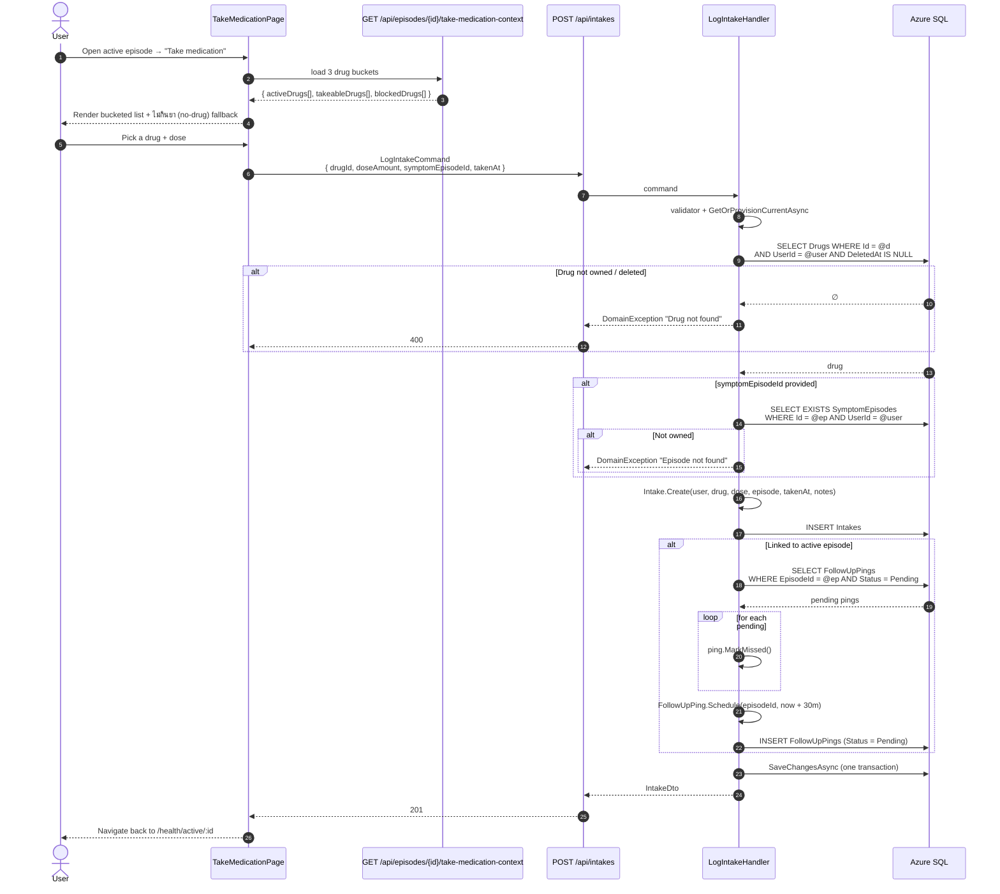

Source: [`LogIntakeHandler`](../backend/src/MenuNest.Application/UseCases/Health/Intakes/LogIntake/LogIntakeHandler.cs). Only **one** pending ping exists per episode at any moment — old pings are marked `Missed` rather than `Cancelled` so the doctor report can still see "scheduled but missed" history.

---

## 10. Health — follow-up push (0-tap response)

A `BackgroundService` on the API polls pending pings every minute and sends a web push via the **WebPush** NuGet package + VAPID keys. The service worker on the user's device shows a notification with up to 4 action buttons. Two of them (**Resolved**, **Same**) POST back directly from the SW without opening the app — that's the headline UX feature: a one-tap response from the lock screen.

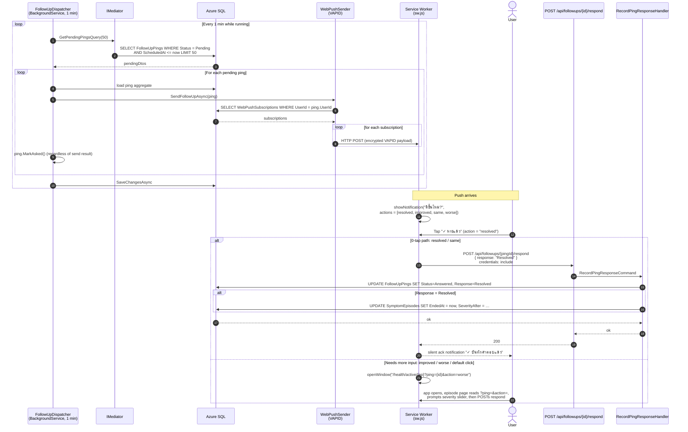

Source: [`FollowUpDispatcher`](../backend/src/MenuNest.Infrastructure/BackgroundServices/FollowUpDispatcher.cs), [`WebPushSender`](../backend/src/MenuNest.Infrastructure/Services/WebPushSender.cs), [`sw.js`](../frontend/public/sw.js).

**Fail-quiet design:** if VAPID keys aren't configured, `WebPushSender` logs a warning and returns 0 — the dispatcher keeps running. Pings still get `MarkAsked` so the in-app modal picks them up the next time the user opens the app.

---

## 11. Health — drug photo upload (SAS, multi-photo)

Drug packaging supports multiple photos. Same SAS pattern as recipe photos but loops over N files and the API verifies the user owns the parent `Drug` before minting each SAS — without that check, a caller could request a SAS scoped under another user's blob path prefix.

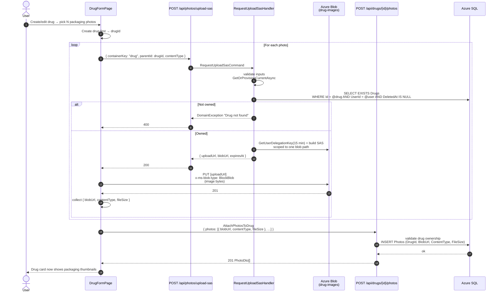

Source: [`RequestUploadSasHandler`](../backend/src/MenuNest.Application/UseCases/Health/Photos/RequestUploadSas/RequestUploadSasHandler.cs), [`AzureBlobSasGenerator`](../backend/src/MenuNest.Infrastructure/Services/AzureBlobSasGenerator.cs).

The attach step is separate from drug create on purpose — if the SAS upload fails after the drug is saved, the user can retry just the photos without re-entering the form. `Photo.Create` requires `fileSize > 0`, which is why a unit test failed if the handler tried to attach photos inline with zero-byte placeholders.

---

## 12. Health — doctor report share link (QR + HMAC)

The patient creates a date-bounded share link. The API returns the raw token **once** as a QR code; the DB stores only a SHA-256 hash. The doctor scans the QR, lands on `/share/<token>` (a public route, no auth), and the SPA calls `/api/public/report?t=<token>` to fetch the full report JSON.

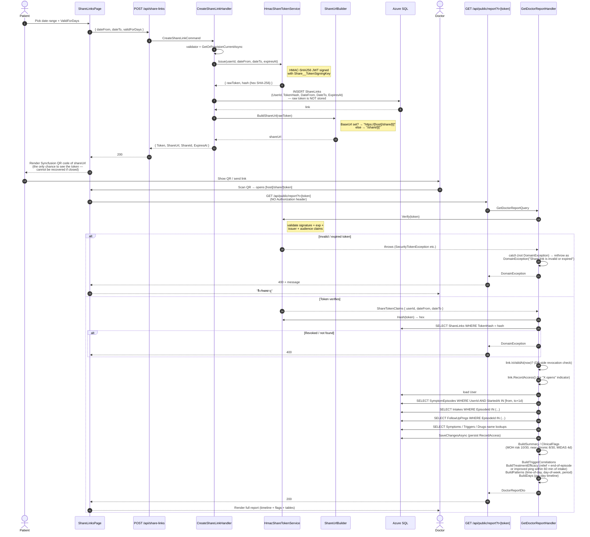

Source: [`CreateShareLinkHandler`](../backend/src/MenuNest.Application/UseCases/Health/Share/CreateShareLink/CreateShareLinkHandler.cs), [`GetDoctorReportHandler`](../backend/src/MenuNest.Application/UseCases/Health/Reports/GetDoctorReport/GetDoctorReportHandler.cs), [`HmacShareTokenService`](../backend/src/MenuNest.Infrastructure/Services/HmacShareTokenService.cs), [`ShareUrlBuilder`](../backend/src/MenuNest.Infrastructure/Services/ShareUrlBuilder.cs).

**Security properties**

- **Token never persisted.** A DB leak does not expose live share links — only their SHA-256 hashes.
- **Two independent checks.** The HMAC signature + `exp` claim verify the token cryptographically. The `ShareLink.IsValidAt(now)` check is what enforces user-driven *revocation* (a patient toggling a link off in `/health/share` flips a flag in the DB; the JWT itself doesn't know).
- **`Share__BaseUrl` must be set on App Service** so the QR encodes an absolute URL. Without it, `ShareUrlBuilder` falls back to `/share/<token>` (a relative path) which the doctor's phone camera can't open. This was the cause of the recent "invalid link when share to doctor" report.
- **Patient SPA opens 400, not 500.** The handler wraps `Verify` in `try/catch (Exception ex) when (ex is not DomainException)` so JWT-layer exceptions (`SecurityTokenException`, etc.) are remapped — the Application layer doesn't take a dependency on `Microsoft.IdentityModel.Tokens`.

---

## Conventions used in these diagrams

- **autonumber** is on for every diagram so steps are easy to reference in code review.
- Each diagram is traced against the actual handler — file names are linked, not paraphrased. If you change a handler, please update the matching diagram in the same PR.
- DB writes inside one handler all happen in **one transaction** (one `SaveChangesAsync`) unless explicitly noted.
- Errors shown as `DomainException` are mapped by `ProblemDetailsMiddleware` to HTTP 400 with the message body — no stack trace leaks to the client.

For implementation plans (per-task breakdowns, test plans), see [`docs/superpowers/plans/`](superpowers/plans/). For overall scope and data model, see [`docs/plan.md`](plan.md).
