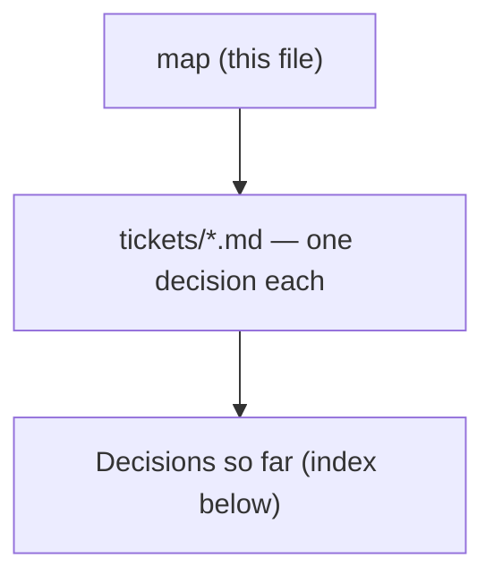

# Decision map - rework the budget app (#99)

## Destination
The reworked budget app is live in prod and in daily use on the phone: each account's balance can be entered and corrected directly, a daily spend allowance is derived from the envelopes, future months can be planned against expected salary that stays visibly separate from real money, and a non-zero Ready-to-Assign is loud but never blocking.

## Notes

<!-- decision-map:notes:start -->
- Tracking issue: https://github.com/ThodsaphonSonthiphin/MenuNest/issues/99 - every commit references it per CLAUDE.md, and new ADRs are named menunest-<number>-<slug>.md.
- The budget already exists and is substantial: BudgetAccount / BudgetCategoryGroup / BudgetCategory / BudgetTransaction / MonthlyAssignment, envelopes, RTA hero, MonthStrip, MoveMoney, QuickAssign, CoverOverspending, three target types. This is a rework, not a greenfield build.
- There are no budget ADRs today - 180 ADRs in docs/adr/ and not one covers the budget - so these decisions are being recorded for the first time.
- CLAUDE.md: the frontend has NO component/visual test harness, so tsc + build + vitest cannot catch a rendering bug. Any UI decision here must be verified interactively or against a docs/mocks/ file before it is called done.
- Prod deploys on push to main. /budget already has four Playwright specs (budget.smoke, budget.interactions, budget.account-tx-crud, budget.add-entry-points) - they are the regression net for this rework and must stay green.
- Answered at chart time and binding on every ticket: budget month = calendar month; phone-first; prod budget data is test data only, so model changes may be destructive; AI/MCP is a first-class surface, not an afterthought.
<!-- decision-map:notes:end -->

## Milestones

<!-- decision-map:milestones:start -->
- `mvp` on the phone: set what each account holds, and see "today you can spend X" [current-budget-audit, ynab-parity-research, account-balance-input, daily-allowance-formula, budget-shell-ux]
<!-- decision-map:milestones:end -->

## Decisions so far

<!-- decision-map:decisions:start -->
#### mvp — on the phone: set what each account holds, and see "today you can spend X"

- [Today's budget - what exists, and where does every number actually come from?](tickets/current-budget-audit.md) — A future month lies four ways today, and two contradictory paths already exist for correcting an account balance.
- [Daily allowance - which money, which days, and what does overspending today do to tomorrow?](tickets/daily-allowance-formula.md) — Everyday-marked envelope money ÷ days left in the month, frozen at a budgeting event and never moved by spending; a separate pace line carries the over/under.
- [YNAB parity - which of its behaviours do we copy, and which do we deliberately break?](tickets/ynab-parity-research.md) — Copy YNAB's future-month mechanic and its zero-out shape; break its no-forecast-income rule deliberately. It has no daily allowance to copy at all.
<!-- decision-map:decisions:end -->

## Not yet specified

<!-- decision-map:fog:start -->
- Whether fast phone spend-logging ("just spent 120" -> in the right envelope in minimum taps) is part of this rework or a follow-up - asked at chart time, no preference given.
- Whether the existing target types (MonthlyAmount, ByDate, MonthlySavingsBuilder) need reworking or new types once planned income exists.
- Whether the envelope groups/categories themselves need restructuring for a phone-first layout - depends on the shell mock.
- Whether Credit accounts need YNAB-style credit-card payment envelopes; BudgetAccountType.Credit exists today but has no special handling anywhere in the use cases.
- Whether the reworked budget changes MenuNest's configurable home page (ADR 081 / 084).
- How two family members budgeting the same month at the same time should behave.
- Where the frozen Daily allowance figure and its freeze date are stored, and what writes them - a new column, a new entity, or a recompute from a stored freeze timestamp. Created by menunest-181: the chosen frozen-figure shape needs persistence that the rejected live re-division did not.
<!-- decision-map:fog:end -->

## Out of scope

<!-- decision-map:scope:start -->
- Payday-to-payday budget cycles - the budget month stays the calendar month.
- Migrating existing prod budget data - it is test data only, so model changes may be destructive.
- Bank or API import of transactions.
- Multi-currency - THB only.
- Spending reports, trends and net-worth analytics.
<!-- decision-map:scope:end -->
