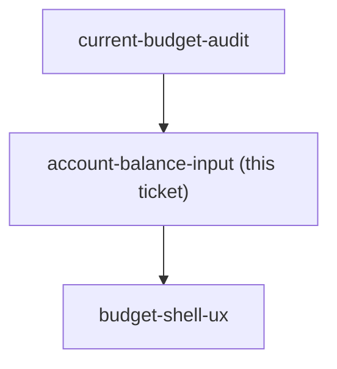
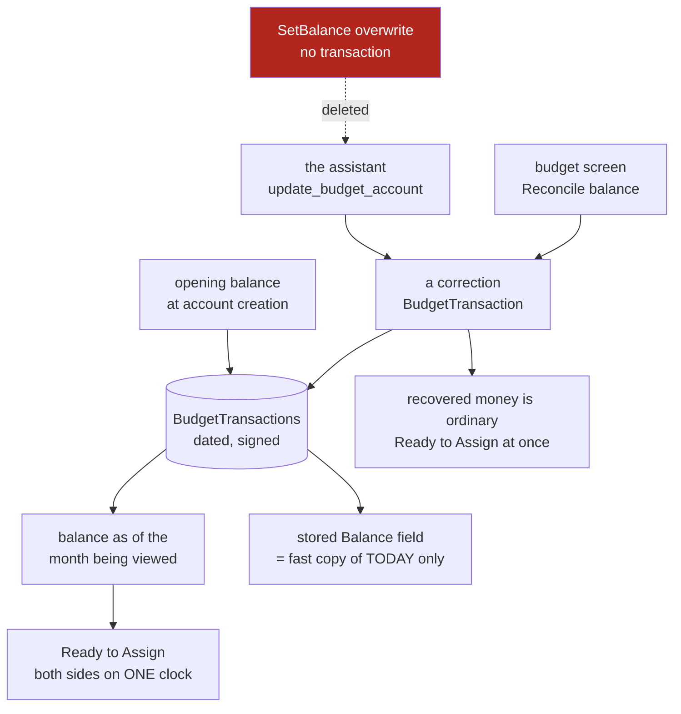

## Question

Today an account's money can only be set as an opening balance at creation; correcting it later goes through ReconcileBalanceDialog, which silently posts an uncategorized adjustment transaction that lands in Ready-to-Assign. Decide the first-class model: is a balance directly settable, or always derived from transactions with reconciliation as the only correction path? What does the user see happen to RTA when they correct a balance, and is that money automatically assignable or quarantined until acknowledged? Does an account get a stated balance per month, or one live balance? This is the requirement the user raised in their own words: it must be possible to enter which account holds how much.

<!-- decision-map:graph:start -->

<!-- decision-map:graph:end -->

<!-- decision-map:resolution:start -->
## Resolution

Every account-money change writes a BudgetTransaction (the silent SetBalance path is deleted); the balance is derived as of the month viewed, and a correction is assignable at once.

Detail: docs/adr/menunest-182-an-account-balance-is-derived-from-transactions-and-every-correction-writes-one.md

The picture is what the answer *creates*: one write path instead of two, a
transaction ledger as the single source of truth, and an account number that
finally moves on the same clock as the envelopes it is compared against. The
stored `Balance` field does not disappear — it is demoted to a cache.

## The confirming exchange

The audit had already found the conflict: the screen posts a correction
transaction, the MCP/API path calls `SetBalance` and overwrites the number with no
transaction, contradicting `BudgetAccount`'s own XML doc. Put as "one of these has
to go", with the user's real data as the case — a `Cash` account reading −6,000,
which a cash account cannot hold.

Three questions, all answered with the recommendation. The first two came back
**[No preference]**, were re-posed in plainer terms after the user said "wait
what", and were then answered together:

> "1"

— i.e. yes to both: every balance fix writes a history line, and the money it
recovers is spendable straight away.

The third was posed as "you look at July; your accounts hold 52,480 today and held
30,000 in July — which does the app show?" against today's-number and
typed-per-month alternatives. The user chose **30,000, derived from the
transactions**.

The recap of all three decisions, plus four consequences the user was not asked
about, was put up for confirmation and answered:

> "yes"

## The four consequences, accepted rather than chosen

- An **opening balance must itself become a transaction** — a derived balance whose
  history begins with a non-transaction begins from nowhere. Migration of existing
  prod data is already out of scope on this map, so this is a model change only.
- **Past months are fixed, future months are not.** Both sides of Ready to Assign
  now sit on the selected month's clock, which repairs every past month. A future
  month still shows money held today, because forecast income does not exist yet —
  that half is `planned-income-model`'s.
- **A second walk over history.** `ComputeEnvelopeAvailable` already loops every
  month since January 2000 per category, twice per summary load; the derived
  account balance adds another pass.
- **Two audit defects stay open**: closed accounts count toward Ready to Assign,
  and `Loan` / `Credit` balances do too. Neither is this question, and both stay in
  the fog.

## What this leaves for other tickets

- `budget-shell-ux` inherits a reconcile affordance that must exist on the phone,
  and no "accept the found money" step to place.
- `conversational-budget-jobs` inherits a narrowed MCP contract: the assistant can
  no longer set a balance, only post a **Balance correction**.
- `planned-income-model` inherits the unfixed half of the two-clock bug.
- Verified against `main` (a32621f) while resolving: `BudgetAccount.Balance` is a
  stored field mutated by `AdjustBalance`/`SetBalance`, and `readyToAssign` sums
  account balances with no `IsClosed` and no account-type filter — so the clock
  mismatch and both open defects are read from the code, not inferred.

<!-- decision-map:resolution:end -->
