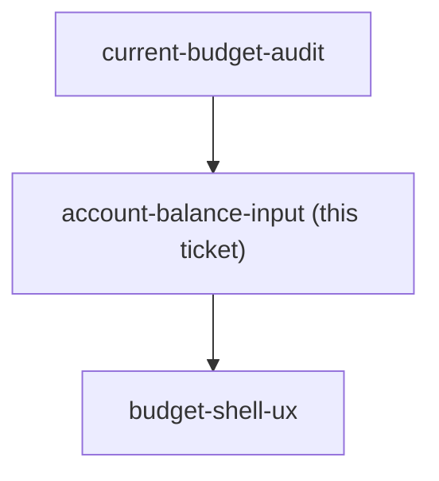

## Question

Today an account's money can only be set as an opening balance at creation; correcting it later goes through ReconcileBalanceDialog, which silently posts an uncategorized adjustment transaction that lands in Ready-to-Assign. Decide the first-class model: is a balance directly settable, or always derived from transactions with reconciliation as the only correction path? What does the user see happen to RTA when they correct a balance, and is that money automatically assignable or quarantined until acknowledged? Does an account get a stated balance per month, or one live balance? This is the requirement the user raised in their own words: it must be possible to enter which account holds how much.

<!-- decision-map:graph:start -->

<!-- decision-map:graph:end -->
