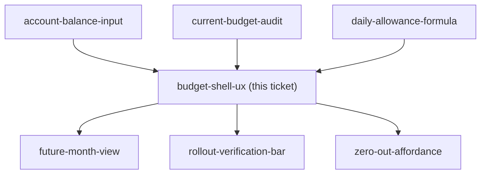

## Question

The stated reason for the rework is that the flow and UX are wrong, so this is the ticket that fixes it. Produce a docs/mocks/ mock of the reworked phone-first /budget and get it approved. Decide: what the user sees in the first screenful (daily allowance, Ready-to-Assign, account totals, envelopes - in what priority), how month navigation works on a phone, which actions are thumb-reachable one-tap (assign, move money, correct a balance, log a spend) and which are buried, and whether the envelope list stays a list or becomes something else. Desktop must not be broken but comes second.

<!-- decision-map:graph:start -->

<!-- decision-map:graph:end -->
