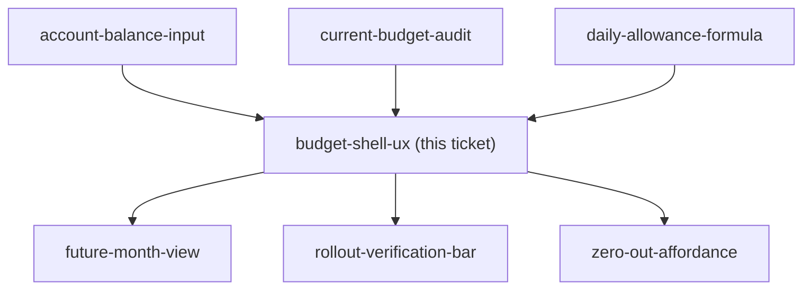
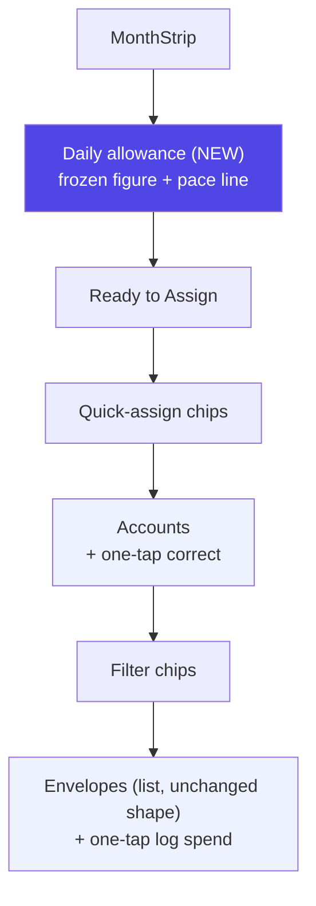

## Question

The stated reason for the rework is that the flow and UX are wrong, so this is the ticket that fixes it. Produce a docs/mocks/ mock of the reworked phone-first /budget and get it approved. Decide: what the user sees in the first screenful (daily allowance, Ready-to-Assign, account totals, envelopes - in what priority), how month navigation works on a phone, which actions are thumb-reachable one-tap (assign, move money, correct a balance, log a spend) and which are buried, and whether the envelope list stays a list or becomes something else. Desktop must not be broken but comes second.

<!-- decision-map:graph:start -->

<!-- decision-map:graph:end -->

## Comment

First-draft mock posted for reaction: Claude Design → "MenuNest design system" → Screens → `screens/budget-shell.html` (card "Budget shell — phone-first /budget").

Recommended answers drawn as the screen, awaiting confirmation:
1. First-screenful priority: Daily allowance above Ready-to-Assign, then quick-assign chips, accounts, filters, envelopes (unchanged tail).
2. New Daily allowance hero shows the frozen figure + pace line (ADR-181) with an explicit "won't change today" line.
3. Balance correction promoted to one tap — a ✎ icon directly on each account card, no detour through account-detail.
4. Logging a spend promoted to one tap — a new + icon on the collapsed envelope row, beside the existing ⇄ move icon.
5. Assign stays behind tap-to-expand (unchanged) — a number entry isn't a single-tap action.
6. Envelope list stays a list — no restructuring, closing that fog line.

<!-- decision-map:resolution:start -->
## Resolution

APPROVED as drawn: daily allowance card leads RTA; balance-correct and log-spend promoted to one-tap icons; assign stays buried; envelope list stays a list.

&lt;!-- decision-map:graph:start -->

&lt;!-- decision-map:graph:end -->

## The approved artifact

**Claude Design → `MenuNest design system` → Screens → "Budget shell — phone-first /budget"**
Project `107862ef-c14b-42f4-a8f2-4bbe36951e25`, path `screens/budget-shell.html`.
Retrieve with `DesignSync get_file`. Registered in `_ds_manifest.json`.

Built from the LIVE `/budget` component code and CSS scope (`BudgetPage.css`'s slate/indigo tokens,
`RtaHero.tsx`, `EnvelopeCard.tsx`, `AccountsStrip.tsx`) rather than approximated — this is a rework of
an already-redesigned surface, not a from-scratch restyle.

## What it pins

- **First-screenful order**: Daily allowance (new), Ready-to-Assign, quick-assign chips, accounts,
  filter chips, envelopes — matching the priority the ticket's own question named.
- **Daily allowance hero (new)** shows the frozen figure and a pace line (ADR-181), with an explicit
  "won't change if you spend more today" line so it reads as frozen, not live.
- **Balance correction promoted to one tap** — a ✎ icon sits directly on each account card in the
  Accounts strip; today it requires opening account-detail first.
- **Logging a spend promoted to one tap** — a new + icon on the collapsed envelope row, beside the
  existing ⇄ move icon; today it is buried behind expanding the card.
- **Assign stays buried on purpose** — it is a number entry, not a single fire-and-forget action, so
  it is left exactly where it is today (tap-to-expand).
- **Envelope list stays a list** — no restructuring into cards/grid/groups; this also closes the
  "envelope groups/categories restructuring" fog line (moved to Out of scope).
- **Desktop unaffected** — the live page's existing responsive max-width scaling (540px / 720px)
  carries the same single column up; this ticket only decided phone-first priority and affordances.
- QuickAssignChips and SuggestedFixCard stay between RTA and Accounts, matching today's order — not
  reconsidered by this ticket.

## Approval

User's confirming words, verbatim: "it ook ok"

<!-- decision-map:resolution:end -->
