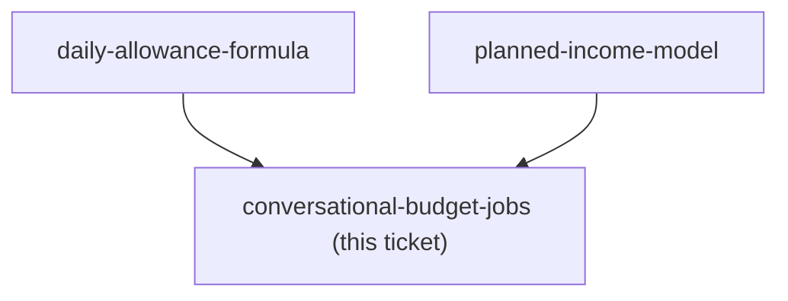

## Question

AI is a first-class surface for this budget, not a mirror of the UI. Decide the concrete jobs that must work end to end in a Claude conversation - for example asking what was spent recently, asking to budget next month, asking how much is left to spend today, logging a spend by voice or text - and for each, what the assistant must be able to read and write. Then decide the tool surface: which new MCP tools the new concepts (planned income, daily allowance, direct account balance) require, whether any existing budget tool changes shape, and what the assistant is forbidden from doing without confirmation given it can move real money.

<!-- decision-map:graph:start -->

<!-- decision-map:graph:end -->
