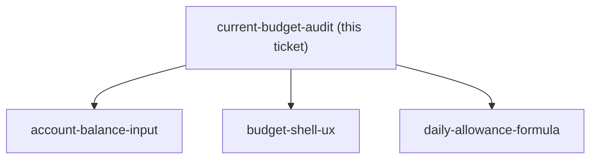
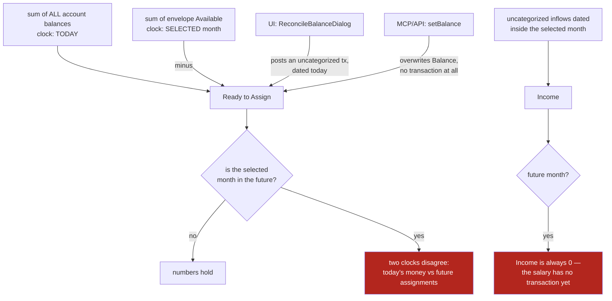

## Question

Produce a precise inventory of the MenuNest budget as it stands: every entity and its fields, every Application use case and WebApi endpoint, every MCP tool, every frontend screen and component under frontend/src/pages/budget/. Then trace the money rules: exactly how Ready-to-Assign, envelope Available, Assigned and Activity are each computed in GetMonthlySummaryHandler, what an uncategorized transaction does to RTA, what ReconcileBalanceDialog posts, and which of those computations quietly assume the selected month is the current month. Name the places a future month would produce a wrong or misleading number today.

<!-- decision-map:graph:start -->

<!-- decision-map:graph:end -->

<!-- decision-map:resolution:start -->
## Resolution

A future month lies four ways today, and two contradictory paths already exist for correcting an account balance.

# Findings — today's budget, and where every number comes from

Audited at chart time for #99 against `main`. Everything below is read from the
code, not inferred.

## 1. What exists

**Domain (5 entities, 2 enums)**

| Entity | Fields that matter |
|---|---|
| `BudgetAccount` | `Name`, `Type`, `Balance`, `SortOrder`, `IsClosed`. Mutators: `AdjustBalance(delta)` and `SetBalance(absolute)` — the XML doc says `SetBalance` is "reconciliation only; prefer `AdjustBalance` driven by `BudgetTransaction`". |
| `BudgetCategoryGroup` | `Name`, `SortOrder`, `IsHidden` |
| `BudgetCategory` | `Name`, `Emoji`, `SortOrder`, `IsHidden`, plus target config: `TargetType`, `TargetAmount`, `TargetDueDate`, `TargetDayOfMonth` |
| `BudgetTransaction` | `AccountId`, **nullable** `CategoryId`, signed `Amount` (outflow negative), `Date`, `Notes`. `CategoryId == null` means income / "Ready to Assign" inflow. |
| `MonthlyAssignment` | one row per (Family, Category, Year, Month), only `AssignedAmount`. May be negative by design — move-money and cover-overspending push a source envelope below zero. |

`BudgetAccountType` = Cash / Credit / Loan / Closed. `BudgetTargetType` = None /
MonthlyAmount / ByDate / MonthlySavingsBuilder.

**Application** — use cases under `UseCases/Budget/`: Accounts (Create, Update,
Delete, List, ListAccountTransactions), Groups (Create, Update, Delete, List),
Categories (Create, Update, Delete), Transactions (Create, Update, Delete, List),
Monthly (GetMonthlySummary, SetAssignedAmount, MoveMoney, CoverOverspending).

**WebApi** — `BudgetController`, route `api/budget`: `GET summary`,
accounts CRUD + `accounts/{id}/transactions`, groups CRUD, categories CRUD,
`PUT monthly/assigned`, `POST monthly/move`, `POST monthly/cover`,
transactions CRUD.

**McpServer** — `BudgetTools.cs`, ~20 tools covering the same surface.

**Frontend** — `pages/budget/`: `BudgetPage` + hooks + `budgetSlice` + one CSS file;
components `MonthStrip`, `RtaHero`, `AccountsStrip`, `EnvelopeList`, `EnvelopeCard`
(+hooks), `QuickAssignChips`, `SuggestedFixCard`, `TransactionUndoToast`, and dialogs
`AddAccount`, `AddGroup`, `AddCategory`, `Transaction`, `MoveMoney`, `QuickAssign`,
`CoverOverspending`, `ReconcileBalance`; plus `account-detail/`
(`AccountDetailPage` + hooks, `AccountHero`, `AccountTransactionList`).
Four Playwright specs: `budget.smoke`, `budget.interactions`,
`budget.account-tx-crud`, `budget.add-entry-points`.

## 2. The money rules, exactly

All of it lives in `GetMonthlySummaryHandler`.

- **Envelope `Available`** — `ComputeEnvelopeAvailable` loops **every month from
  January 2000** to the selected month and accumulates `assigned + activity`.
  Rollover is therefore implicit and cumulative, and **a negative balance rolls
  forward too** — there is no YNAB-style "overspending is absorbed and the
  envelope restarts at zero next month".
- **`Assigned` / `Activity` for the month** — the selected month's slice of that
  same walk.
- **`Income`** — sum of **positive, uncategorized** transactions dated inside the
  selected month.
- **`readyToAssign` = `sum(all account balances)` − `sum(envelope Available across
  ALL categories, including hidden)`.** The hidden-category inclusion is
  deliberate and commented.

## 3. Where a future month lies today — the important part

`MonthStrip` → `goNextMonth` is **unbounded**; you can already navigate to any
future month and the handler will compute it. What comes back is wrong in four
distinct ways:

1. **RTA is computed month-relative on one side and absolute on the other.**
   `totalEnvelopeAvailableAllCats` is computed *as of the selected month*, but
   `totalAccountBalance` is **today's** balance, always. So next December's RTA is
   "the money I hold right now, minus everything I've assigned through December".
   Nothing about future income is in it.
2. **`income` for a future month is essentially always 0**, because it counts
   uncategorized transactions *dated* in that month, and a salary that hasn't
   arrived has no transaction. The "เงินเดือนออกเท่าไหร่" half of #99 has no
   source of truth at all.
3. **Assigning into a future month silently reduces that month's RTA but not the
   current month's** — because the subtrahend is as-of-selected-month. The two
   months disagree about how much money exists.
4. Consequence: **there is no honest "budgeted / left" for a future month today.**
   This is the gap `planned-income-model` and `future-month-view` exist to close.

## 4. Two contradictory paths for correcting an account balance

This is directly under `account-balance-input`, and the conflict is already shipped:

- **UI** — `ReconcileBalanceDialog` asks for the true balance, computes
  `actual − tracked`, and posts a **single uncategorized transaction** for the
  difference, dated **today** (not the selected month), notes `"Manual balance fix"`.
  Because it is uncategorized, that difference lands **straight in Ready to
  Assign** as newly assignable money. It leaves an audit trail.
- **MCP / API** — `update_budget_account` takes `setBalance`, and
  `UpdateAccountHandler` calls `acc.SetBalance(...)`, **overwriting the balance
  with no transaction at all**. RTA moves with no audit trail and no record of why.

So the same user intent has two implementations with different side effects, one
of which contradicts the entity's own XML doc. Whatever `account-balance-input`
decides, one of these has to go.

## 5. Other defects found while tracing

- **`MonthlySavingsBuilder` targets render no progress.** `ComputeProgress`
  handles `MonthlyAmount` and `ByDate` and then falls through to
  `(null, null)` — the third target type has a domain method, an enum value and an
  MCP parameter, but no progress fraction and no hint anywhere in the UI.
- **Closed accounts still count toward RTA.** The `totalAccountBalance` sum filters
  on `FamilyId` only — no `IsClosed` filter.
- **`Loan` and `Credit` balances count toward RTA.** A negative loan balance
  directly reduces the money the app says you can assign. YNAB keeps loans as
  off-budget tracking accounts. No use case anywhere special-cases
  `BudgetAccountType.Credit` — grep confirms zero hits.
- **`ComputeEnvelopeAvailable` is O(months × categories) in memory**, ~320 month
  iterations per category as of 2026, each doing a LINQ `Where().Sum()` over that
  category's transactions, and it is run twice (once for visible groups, once for
  all categories). It works at current data sizes; it will not scale, and it is
  called on every summary load.
- **MCP doc drift**: `create_budget_category` describes `targetDayOfMonth` as
  "used with MonthlySavingsBuilder", but `SetMonthlySavingsBuilderTarget` sets
  `TargetDayOfMonth = null`.

## 6. What this means for the map

- `account-balance-input` starts from a real conflict, not a blank page — pick one
  of the two existing paths and delete the other.
- `daily-allowance-formula` must decide what to do about negative rollover, which
  is currently unbounded and cumulative.
- `planned-income-model` has no existing concept to extend; `income` as it stands
  cannot serve it.
- The RTA formula's treatment of closed / loan / credit accounts is a correctness
  question that sits underneath everything and is currently fog.

<!-- decision-map:resolution:end -->
