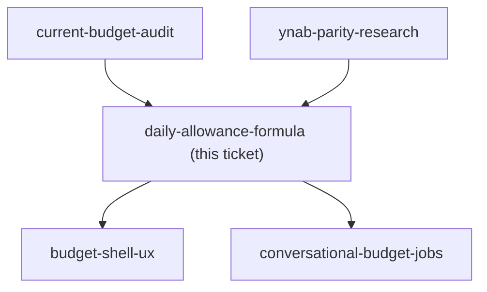

## Question

The daily budget is a derived spend allowance, not a new envelope type. Decide the formula precisely: which envelopes feed it (all of them, or only a day-to-day subset excluding Bills and savings, and how is that subset chosen), what counts as days remaining in a calendar month, and whether the number is recomputed live. Then decide the behaviour that makes or breaks it: if today's spending exceeds the allowance, does tomorrow's number shrink, or does each day reset to the same figure? If a day is underspent, does the surplus raise tomorrow's number or vanish? What does the number show on the last day of the month, and what does it show when the feeding envelopes are already overspent?

<!-- decision-map:graph:start -->

<!-- decision-map:graph:end -->
