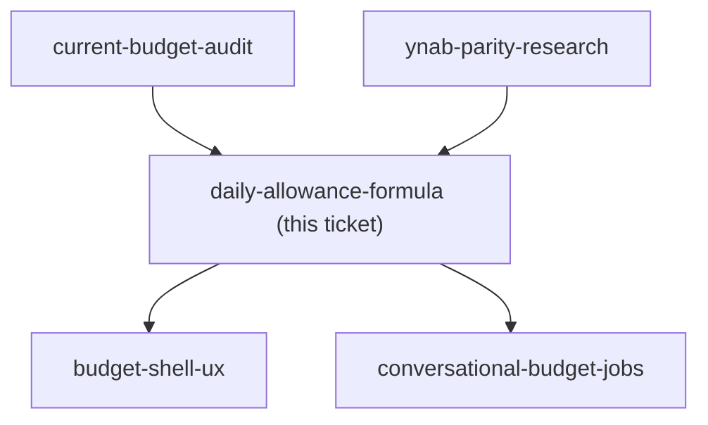
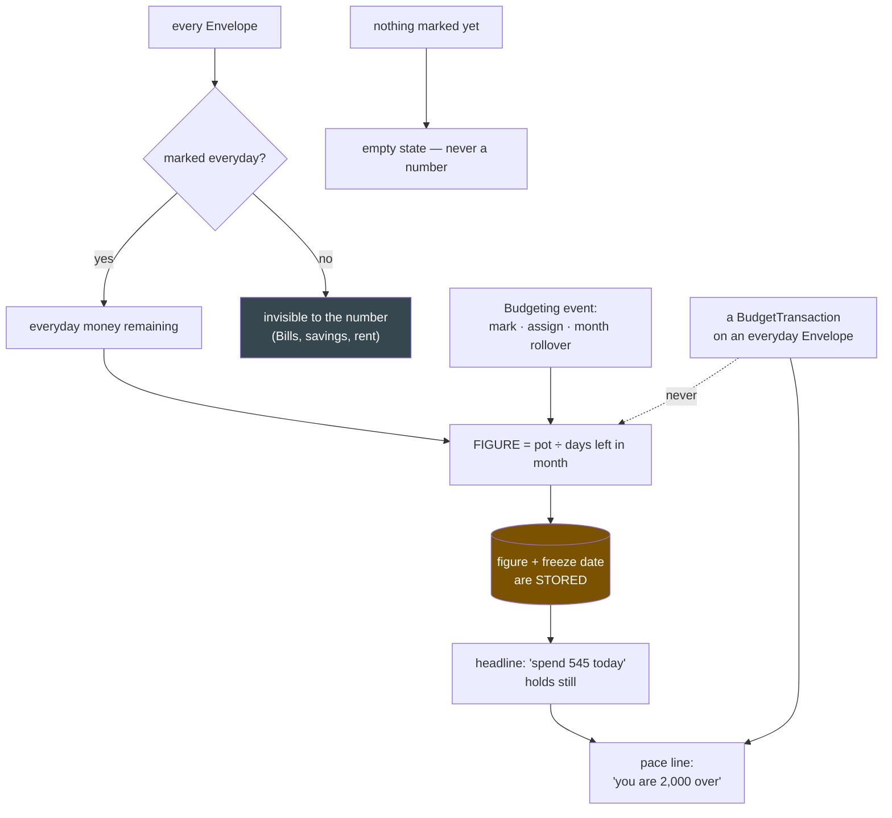

## Question

The daily budget is a derived spend allowance, not a new envelope type. Decide the formula precisely: which envelopes feed it (all of them, or only a day-to-day subset excluding Bills and savings, and how is that subset chosen), what counts as days remaining in a calendar month, and whether the number is recomputed live. Then decide the behaviour that makes or breaks it: if today's spending exceeds the allowance, does tomorrow's number shrink, or does each day reset to the same figure? If a day is underspent, does the surplus raise tomorrow's number or vanish? What does the number show on the last day of the month, and what does it show when the feeding envelopes are already overspent?

<!-- decision-map:graph:start -->

<!-- decision-map:graph:end -->

<!-- decision-map:resolution:start -->
## Resolution

Everyday-marked envelope money ÷ days left in the month, frozen at a budgeting event and never moved by spending; a separate pace line carries the over/under.

Detail: docs/adr/menunest-181-the-daily-allowance-freezes-a-figure-and-a-pace-line-carries-the-overspend.md

The picture above is what the answer *creates*: two numbers with two different
jobs. The headline is frozen and only a deliberate budgeting act moves it; the
pace line is the only thing that reacts to spending. The stored figure (amber) is
the new cost this shape carries.

## The confirming exchange

Asked which money feeds the number, over three options (all envelopes / marked
everyday envelopes / accounts minus bills), the user chose the marked subset and
added the constraint that shaped the rest:

> "elopes that we can mark later as every day"

— i.e. the marking is incremental, not an up-front setup pass. That is why the
day-one empty state exists at all.

Asked the make-or-break question — everyday envelopes hold 10,000 over 31 days so
the card reads ~322; you spend 2,000 on day 5; what does day 6 show? — against
A (re-divide live, ~250), B (stay 322 plus an "over by 2,000" line) and
C (stay 322, no memory), the user answered:

> "b"

This rejects the recommendation. A was recommended because it stores nothing and
can never disagree with the envelopes; B was chosen for a headline that holds
still, and the persistence cost was named in the recap and accepted.

Two follow-ups then made B precise, both answered with the recommendation: adding
3,000 to Food on day 12 **does** re-freeze the figure ("recompute, but only when
you budget"), and the second line counts **pace**, not money left. A third fixed
the divisor at **days remaining at the freeze**, not days in the month — put with
the real case that nothing is marked today, so the first freeze is necessarily
mid-month (6,000 ÷ 11 = 545, where 6,000 ÷ 31 = 194 under-states by two thirds).

The recap of all six decisions, plus the three consequences the user was not asked
about (frozen headline on the last day, floor at 0, the persistence cost), was put
up for confirmation and answered:

> "continue next ticket"

## Recorded but not argued

Two sub-points came back **[No preference]** and are the recommendation rather
than the user's choice — a later session may reopen either without overturning a
decision:

- the everyday mark lives on the **Envelope**, not on its group;
- before anything is marked the card shows an **empty state**, not a number built
  from unmarked envelopes.

## What this leaves for other tickets

- `budget-shell-ux` inherits two numbers to place on the phone screen, not one,
  plus an empty state for the un-set-up case.
- `conversational-budget-jobs` inherits "how much can I spend today" as an MCP
  read, and marking an envelope as everyday as an MCP write.
- The interaction with `planned-income-model` is untouched here: forecast salary
  is not everyday money and must not enter the pot.
- Verified against `main` (de2a88b) while resolving: neither `BudgetCategory` nor
  `BudgetCategoryGroup` carries any day-to-day/bills flag today, so the mark is a
  new field either way — the group option was not cheaper.

<!-- decision-map:resolution:end -->
