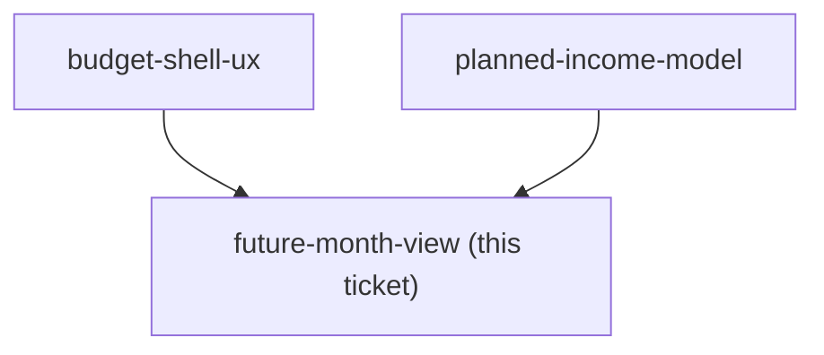

## Question

Decide what the user sees after flipping MonthStrip forward: which of expected-in, budgeted, and left are shown, how far ahead months can be planned, and how rollover from the current month is presented alongside planned income without the two blurring into one number. Then decide the honesty requirement: what makes it visually unmistakable that these are forecast figures and not money in hand, so the user never mistakes a planned month for a funded one. Decide whether assigning into a future month is allowed to exceed planned income, and what the screen does when it does.

<!-- decision-map:graph:start -->

<!-- decision-map:graph:end -->
